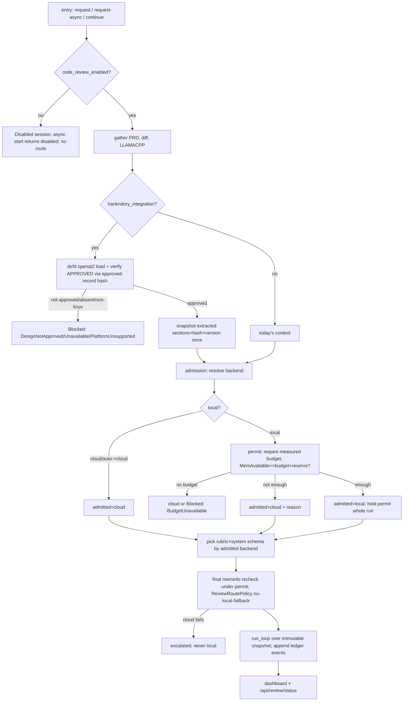

# HankNDory ↔ Brainrouter integration and reviewer hardening

## Status

- **Workflow state:** approved-for-implementation
- **First release** FR-A + FR-C = `implementation-complete` on-branch (`4fe4ecb`, `38c86db`). **Hardening track (full scope), v6** — the user answered the three product decisions and instructed "Scope: full. Proceed & install skill, and when done commit all to main on strix, push to ajaxdude/brainrouter via strix" (2026-09-18). Deploy to strix `master` + GitHub is now **authorized** for the completed, mean-reviewed track.
- **Precedence note:** where the older Detailed implementation / Security / Risks / Open-questions / Decision-log text conflicts with the "## Hardening track" spec below, **the Hardening track spec wins** — specifically, design-aware review is **Linux + macOS** (not "Linux-only"; the earlier "non-Linux fails closed" text is superseded except for genuinely unsupported OSes), and the hardening track is **approved** (earlier "pending"/"not approved" notes are historical).
- **v6 decisions (2026-09-18):** (1) OOM posture = **(a) best-effort `/proc/meminfo` gate**; (2) design-aware review = **Linux (`openat2`) + macOS (`canonicalize` + containment + `O_NOFOLLOW`)**; (3) reviewer default `auto` (cloud iff Manifest enabled, else local) **confirmed**; (4) FR-B works whether `prompt_rewrite` is **ON or OFF**; (5) scope = **full**.
- **Change classification:** **standard.** Changes the `request_review` MCP tool schema, `ReviewConfig`, a new immutable `ReviewAdmissionConfig`, persisted runtime/ledger state, reviewer routing, the dashboard UI, `install.sh`, and adds a `/proc/meminfo` model-admission safety gate. HankNDory rule 11 forbids treating any of these as trivial.
- **Revisions:**
  - `v1 — 2026-09-17 — initial draft`.
  - `v2 — 2026-09-17 — major revision` after Dory round 1 (durable ledger, strict routing, admission permit, safe-open, approval verification, disabled short-circuit, rewriter bypass, `review_state.json`→`review_runtime_state.json`, CSRF gating, reconciled APPEND, prompt budget, installer ownership).
  - `v3 — 2026-09-17 — hardening revision` after Dory round 2. Resolves all 11 blocking + 5 important findings by pinning the hard safety items to **conservative first-release** contracts (details in the Dory validation record).
  - `v4 — 2026-09-17 — scope split (autonomous)`. After Dory round 3 (critic 3-round cap reached, readiness NOT READY) and with the user unavailable but delegating ("work autonomously and make good decisions"), the feature is split: a **safe first release** (converged, low-risk pieces) is finalized to READY and may be implemented on-branch and **not** deployed; the **memory-gated local reviewer + design-approval-integrity pieces are deferred** to a hardening track pending the three product risk decisions the user alone should make. See "Scope decision (v4)".
  - `v5 — 2026-09-18 — full hardening spec` (H1–H9) after the user answered all decisions and approved full scope.
  - `v6 — 2026-09-18 — hardening round-2 resolutions`: propagated the Linux+macOS decision and hardening-approval through the doc (precedence note); resolved the round-2 critic findings (fresh-install budget contract, admission decision table + `try_acquire` semantics, lifecycle transition table + `Failed`, approval threat-model + `bestEffort` removed, ledger schema + restart reconciliation, `GET /api/review/status` redaction, sentinel producer in the vendored APPEND block). See "Hardening track — v6 resolutions".
  - `v7 — 2026-09-18 — FR-B gate preservation shipped`: implemented the rewriter sentinel-preservation half of FR-B (`rewrite_for_local` keeps one well-formed `HANKNDORY:GATE:START v1…END` block across the local lean-prompt rewrite; fail-closed on any duplicate/malformed marker across the whole message set; byte-identical when absent). The reviewer-internal rewrite bypass half of FR-B remains deferred (low impact: reviewer criteria live in the user turn, and `prompt_rewrite` is off on strix). See Dory Round 8.
  - `v8 — 2026-09-18 — local model choice is a dropdown (user request)`: the routing UI's **main** and **reviewer** model controls are now a constrained `<select>` of llama-swap-available local models (from `/api/routing-models` → `local.models`) whenever their backend is `local`, replacing the free-form combobox. Keeps a `Local default` option, preserves a saved-but-unlisted model as a `(saved)` option, and offers a `Custom ID…` escape hatch (revealed input) for discovery-error / not-yet-loaded models. Cloud stays free-form. See Dory Round 9.
  - `v9 — 2026-09-18 — subagent pool dropdown (completes the local-dropdown request)`: applied the same constrained dropdown to the always-local **subagent pool** field (the last local free-form control), with an `Unconfigured (auto)` empty option. `routingModelValue` now treats a backend-less role as local. See Dory Round 10.
  - `v10 — 2026-09-18 — design-aware review wired live (P2a + P2b, H5)`: shipped the security-critical `src/review/design_doc.rs` (TOCTOU-safe `openat2`/`O_NOFOLLOW` load + SHA-256-bound approval record) and wired it into the review loop behind `review.hankndory_integration` (default off). When on, a review resolves the approved design once, fails closed (escalates) if it is unavailable or unapproved, and otherwise judges the diff against an `APPROVED DESIGN DOCUMENT` prompt section with divergence criteria. Added `POST /api/review/approve-design` + `/api/review/design-status`. See Dory Rounds 11–12.
  - `v11 — 2026-09-18 — dynamic review language (P3, H6/R9)`: the review criteria now adapt to the admitted backend — a local model gets terse, numbered, strict-JSON-only criteria; cloud keeps the expansive guidance. `build_review_prompt` gained a `local` flag set from `choice.backend()`. Cloud output is byte-identical to before. See Dory Round 13.

## Scope decision (v4)

The full v3 design remains the architectural record. v4 **splits delivery** so a safe subset can ship without the deferred risk. This section is normative for the first release.

### First release (in scope; low-risk; no memory/routing/design-doc changes)

**FR-A — Code-review master switch (G10, R10).**
- Runtime state file `<config_dir>/review_runtime_state.json` = `{"schema_version":1,"code_review_enabled":true}`, read at daemon start, written atomically (shared `atomic_write`, parent-dir fsync). Absent/corrupt ⇒ default `true`, never blocks startup.
- `session.rs`: add `ReviewStatus::Disabled` (external wire string `"disabled"`, via its `as_str()`; the dashboard `deriveStatus`/pill and every `match` arm updated); make `reviewer_type: Option<ReviewerType>` (`None` for disabled) — the only enum-shape change.
- Shared `admit_or_disabled()` guard called by `start_review`, `start_review_async`, and `handle_continue_review`. Disabled ⇒ create a session already `Disabled`, **no routing/spawn**; `start_review_async` returns `{"sessionId":<id>,"status":"disabled"}`; blocking returns the same terminal shape.
- `continue`/`resolve`/`lgtm` on a session whose own status is `Disabled` ⇒ HTTP 409 `{"error":"code review is disabled"}`. Already-running/escalated sessions are unaffected (the switch is read at admission only; in-flight reviews finish).
- `mcp_server.rs`: add `"disabled"` to the terminal set; inspect the async **start** response `status` and return immediately when `"disabled"` (no 5 s poll).
- APIs (mirroring `/api/nudge`): `GET /api/review/enabled` → `{"enabled":bool}`; `POST /api/review/enabled` body `{"enabled":bool}` ⇒ persist, return `{"enabled":bool}`. Add `|| path.starts_with("/api/review/")` to the CSRF/local-only destructive guard (`server.rs:250-277`).
- Dashboard: a toggle mirroring nudge (`main_dashboard.html` template) defaulting to the persisted value; a grey `disabled` status pill with no action buttons.

**FR-B — Rewriter reviewer-bypass + gate preservation (G3, R3).**
- Reviewer-internal LLM calls never pass through `maybe_rewrite_local` (a `bypass` flag on the reviewer route path). This is inert for cloud reviewers and prevents a local reviewer's system framing from being swapped.
- `rewrite_for_local`: preserve exactly one block delimited `<!--HANKNDORY:GATE:START v1-->` … `<!--HANKNDORY:GATE:END-->`. Version whitelist `{v1}`; no nesting; duplicate/unterminated/unknown-version/over-`MAX_GATE_BYTES`(4096) ⇒ not preserved; non-string system content untouched; the block is re-emitted verbatim after the lean prompt regardless of original position; all other prose still collapses (unchanged behavior when no sentinel is present — so this is inert until the vendored skill emits sentinels).

**FR-C — Skill vendoring + installer step + reconciled APPEND (G5, G7, R5, R7).**
- Vendor `assets/skills/hankndory/{SKILL.md,agents/ui_metadata.yaml,reference/design-doc-template.md,SOURCE}` and `assets/skills/hankndory/APPEND_SYSTEM.snippet.md` containing the literal managed block:
  ```
  # >>> brainrouter-managed (hankndory) v1 >>>
  ### Brainrouter review = HankNDory Step 9 (post-implementation)
  - Brainrouter's `request_review` is the post-implementation "mean code review" (HankNDory Step 9). It does NOT replace the pre-implementation Dory gates (comprehension, critic, readiness), which must still run in separate, fresh sessions.
  - Keeping review-feedback iteration in one session applies to this post-implementation review loop ONLY. Dory validation phases must each run in their own fresh session.
  - The reviewer may run on cloud OR local; Brainrouter chooses the backend. (Do not assume "local".)
  - If `request_review` returns `status: "disabled"`, the code reviewer is turned OFF in Brainrouter; committing without a review is allowed in that mode.
  # <<< brainrouter-managed <<<
  ```
- `install.sh`: an optional idempotent `confirm_step` that, **as the target user** (`SUDO_USER`), copies the skill dir into `~/.omp/agent/managed-skills/hankndory/` (and `~/.copilot/skills/hankndory/` if present), refusing symlinked path components; and performs a one-time fingerprint migration of `~/.omp/agent/APPEND_SYSTEM.md` — back up, replace the recognized legacy stanza (fingerprint = the exact quoted lines incl. "routes your review to a local LLM" and "all iteration stays in the same session") with the managed block; abort with printed manual instructions if the legacy text has diverged or a managed block already exists differently. Prints the OMP `enableSkillCommands` note and runs an acceptance check (skill dir present + parseable). Idempotent (skip when identical). **Not executed by the daemon; only when the user runs `install.sh`.**

*Why this subset is safe:* it changes no request routing, loads no design document, runs no memory gate, and adds no ledger — so Dory findings B1/B2/B3/B4-Blocked/B6/B8/B10-ledger/B11/F1/F4/F6/F7 (all tied to the deferred pieces) do not apply. FR-A's only cross-cutting change is the additive `ReviewStatus::Disabled` + `Option<ReviewerType>`; FR-B is inert without a sentinel; FR-C is repo assets + an opt-in installer step.

### Deferred hardening track (out of scope for the first release)

Design-aware review (G1), the memory-gated local reviewer + admission/permit/budget (G8), dynamic *local* review language (G9), the HankNDory panel + verdict↔state ledger (G2/G4), the reviewer-backend `auto` default change, `ReviewAdmissionConfig`, `review_ledger.json`, the design-doc `openat2` loader + approved-record, `/api/review/status` + `/api/review/hankndory`, and the whole-request token budget. These carry the OOM risk and the design-approval-integrity complexity and depend on the three product decisions below. Their v3 contracts stand as the starting point; residual round-3 findings F1–F8 apply to this track and must be closed (and re-validated) before it is implemented.

### Three product decisions for the user (block the hardening track only)

1. **Local-reviewer OOM posture** (Open question 1): best-effort `/proc/meminfo` gate as designed, vs. a hard systemd `MemoryMax` on the *llama-swap service* (not the reviewer alone — F8), vs. serialize *all* Brainrouter local dispatches (adds main-agent latency).
2. **Design-aware review Linux-only** (dirfd `openat2`; non-Linux fails closed) — acceptable, or is a non-Linux path required?
3. **Reviewer-backend default** — keep today's explicit `forced_mode` (strix already `cloud`) and introduce no `auto` in the first release, confirming the hardening track may later add `auto` = cloud-iff-Manifest-enabled.

## Hardening track v5 — approved implementation spec

Full scope, approved 2026-09-18. Resolves the round-3 residuals (F1–F8) and readiness blockers with concrete contracts; the user's five decisions are baked in. Ships behind the default-OFF `hankndory_integration` switch (except the always-on reviewer-hardening: admission, strict routing, dynamic language, `auto` default). Builds on the shipped FR-A runtime-state file and FR-C packaging.

**H1 — Config: `ReviewAdmissionConfig` (resolves F1, readiness-B1; separate from `ReviewConfig`).** New top-level `brainrouter.yaml` section, its own `#[serde(default)]`, loaded once onto `ReviewService`, **never** round-tripped through `ProfileStore`/`/api/review-config`:
```yaml
review_admission:
  local_model_budget_mb: {}        # map<model_key, u64>; measured peak residency. Empty ⇒ no local budget known.
  system_reserve_mb: 4096          # OS/other-workload headroom kept free.
  local_review_permits: 1          # first release pinned to 1.
```
Unknown fields inside the section are ignored (not `deny_unknown_fields`). An older binary ignores the whole unknown section (documented downgrade).

**H2 — Backend admission (resolves F1/F8, R8).** `model_key` = the reviewer `ModelChoice`'s resolved local model key (from the profile; for `auto`→local it is `fallback_model`). Resolution: `configured_backend` `auto` ⇒ cloud iff `manifest.enabled`, else local; explicit `cloud`/`local` honored. Local path: acquire the single global `Semaphore(local_review_permits)` permit; require `local_model_budget_mb[model_key]` (**absent ⇒ cloud** with reason `budget_unavailable`, or `Blocked::BudgetUnavailable` if cloud is also unavailable — never guess a budget); read `/proc/meminfo MemAvailable`; admit local iff `MemAvailable ≥ budget + system_reserve_mb` (else cloud + `insufficient_headroom`). Hold the permit for the **whole multi-iteration run**; a continuation re-admits under a new permit. **Best-effort** (decision 1a): non-Brainrouter memory consumers are not coordinated; `system_reserve_mb` absorbs one concurrent main-agent model, and an **optional** ops mitigation is a `systemd MemoryMax=` on the **llama-swap service** (documented in README, not applied by brainrouter — F8: a reviewer-only cap is not architecturally available).

**H3 — Strict reviewer routing (resolves I1, R8).** A typed `ReviewRoutePolicy { Cloud, Local }` on the reviewer dispatch: admitted-cloud → Manifest with `allow_local_fallback=false` (a Manifest failure/disabled/open-circuit ⇒ `escalated`, **never** llama-swap); admitted-local → llama-swap directly. Invariant `effective_provider`: `Some("manifest")`↔cloud, `Some("llama-swap")`↔local, `None` on failure. Cover every failover branch at `router.rs:496-568`.

**H4 — Review lifecycle statuses (resolves F3, readiness-B3, R10-blocked).** `ReviewStatus` gains `Disabled`, `Blocked(BlockReason)`, `Failed`. `BlockReason ∈ {DesignNotApproved, DesignUnavailable, BudgetUnavailable, PlatformUnsupported, PersistenceFailure, TruncatedEvidence}`. External wire strings (serde + explicit `as_str`): `disabled`, `blocked:design_not_approved`, `blocked:design_unavailable`, `blocked:budget_unavailable`, `blocked:platform_unsupported`, `blocked:persistence_failure`, `blocked:truncated_evidence`, `failed`. `needs_revision` stays **non-terminal** during the loop and terminal only at `max_iterations` (then `escalated`). All are added to the MCP + CLI terminal sets and returned by the async **start** response. `resolve`/`lgtm` remain valid for `escalated`/running sessions but reject sessions whose own status is `Disabled`/`Blocked`/`Failed` (HTTP 409). `reviewer_type` already `Option`.

**H5 — Design-doc load + approval (resolves F2/F7, readiness-B2, R1; decision 2 Linux+macOS).** New `src/review/design_doc.rs`.
- *Safe-open:* **Linux** — open the git-root dir FD, then `openat2(RESOLVE_BENEATH|RESOLVE_NO_SYMLINKS)` the full `docs/design/<file>` from that FD; operate through the FD only. **macOS** — `canonicalize()` the git root and the target, assert the canonical target is under `<canonical_root>/docs/design/`, then open with `O_NOFOLLOW` on the final component; documented as a slightly weaker (small canonicalize-then-open window) but safe guarantee for a single-user local repo. Other OS ⇒ `Blocked::PlatformUnsupported`. Require a regular UTF-8 file ≤ 512 KB.
- *Resolution order (F7):* explicit `designDoc` arg (no auto-discovery if it fails) → exactly one `docs/design/*.md` → a unique branch-token match (git branch name tokenized on `-`/`_`, matched against file stems); **if still ambiguous ⇒ `Blocked::DesignUnavailable`** with a message telling the caller to pass `designDoc` (never guess).
- *Approval (F2):* parse `## Status` for a `**Workflow state:** approved-for-implementation` line and `## Human approval` for a non-empty approval paragraph (or the literal "human review skipped by user judgment"). Bind approval to content via a local **approved-record** `<config_dir>/review_approvals.json` (atomic write): `{ "<repo_rel_path>": { "sha256": "...", "approved_version": "vN", "approver": "...", "approved_at": "RFC3339" } }`. A review requires the doc's current SHA-256 to match the record; a mismatch ⇒ `Blocked::DesignNotApproved` (editing the doc invalidates approval). Written by a new local-only `POST /api/review/approve-design {path}` (records the current hash) and readable/removable via the dashboard panel. `bestEffort` is **not** in the MCP schema; it is a dashboard/CLI-only advisory mode that can never return `approved` (maps a would-be `approved` to `needs_revision` with an "advisory, unapproved design" note).

**H6 — Prompt budget + dynamic language (resolves F4, readiness-B5, R9).** Whole-request token budget by admitted backend: **cloud** context 128 000 / output reserve 16 384; **local** context = the llama-swap model's configured context if known else 8 192 / output reserve 2 048; safety margin 10%; byte→token ≈ `ceil(bytes/4)`. Deterministic section quotas + truncation order (lowest first): `SESSION HISTORY` → `GIT DIFF` (keep head+tail) → `PRD` → `APPROVED DESIGN` (keep Status/Goals/Requirements/Detailed implementation/Risks/Human approval, drop others first) → `AGENT CONTRACT`; `TASK DETAILS` + `REVIEW CRITERIA` are never dropped. A `truncated_required` flag is set when design or diff material is dropped/unavailable; the loop then converts any `approved` verdict to `Blocked::TruncatedEvidence`. The canonical verdict JSON schema lives in the **system** message. Criteria variants: cloud = expansive; local = short, numbered, strict-JSON-only.

**H7 — Append-only ledger (resolves F6/B11, readiness-B7, R4).** New `<config_dir>/review_ledger.json`, a bounded (cap 500) append-only event list, disk-first atomic (temp+rename+**parent-dir fsync**; on rename-then-dir-fsync failure, log and keep the on-disk file — do not roll back memory to diverge from disk). Event: `{event_id, session_id, run_id, iteration, kind, actor, ts, backend fields; and integration-gated design_path_rel/design_sha256/design_version/review_state}`. `kind ∈ {Admitted, LlmVerdict, HumanResolution, TerminalFailure}`; `Admitted` persisted **before** dispatch (a failed Admitted write ⇒ `Blocked::PersistenceFailure`, no dispatch). Eviction removes only terminal-run records, never a run with no terminal event yet. Corrupt/absent on load ⇒ start empty (log). Always-on audit fields (admission/backend) vs integration-gated HankNDory fields (design/verdict-state) are separate keys (B9).

**H8 — APIs + dashboard (resolves readiness-B4/B6, R2/R6).** `GET/POST /api/review/hankndory` (default OFF, persisted in the FR-A runtime-state file, extended to `{schema_version, code_review_enabled, hankndory_integration}`); `POST /api/review/approve-design`; `GET /api/review/status` (local-only) returning:
```json
{ "code_review_enabled": true, "hankndory_integration": false,
  "sessions": [ { "session_id": "...", "configured_backend": "auto", "admitted_backend": "cloud",
    "effective_provider": "manifest", "fallback_reason": null,
    "design": { "path": "docs/design/x.md", "sha256_prefix": "ab12…", "version": "v3", "approved": true, "state": "..." },
    "review_state": "review_approved" } ],
  "recent_events": [ /* redacted ledger events, repo-relative paths only */ ] }
```
All `/api/review/*` POST are already in the CSRF/local-only guard (FR-A added the prefix). Paths are repo-relative/redacted (no absolute paths). Dashboard: a HankNDory panel (shown when integration on) rendering `/api/review/status`; the FR-A `disabled` pill is joined by `blocked:*`/`failed` pills (neutral/red, no action buttons). New node harness `scripts/test-review-dashboard-ui.cjs` (the benchmark harness targets `benchmarks.html`).

**H9 — FR-B works ON or OFF (resolves R3; decision 4).** Reviewer-internal calls always pass `bypass_local_rewrite=true` (moot when `prompt_rewrite` OFF, effective when ON) so the reviewer's own system framing is never swapped. Main-agent sentinel preservation in `rewrite_for_local` is active when the rewriter runs (ON); when OFF, the full prompt passes through untouched so the skill is inherently preserved. Tests assert both: (ON) marked block survives + reviewer bypass; (OFF) passthrough leaves any skill/system content intact and reviewer calls are unaffected. Verdict→HankNDory-state mapping uses non-Hank statuses: `approved→review_approved`, `needs_revision→review_revisions_required`, `escalated→review_escalated` (doc's own parsed state stays authoritative — I3).

**Verdict↔state authority (I3).** The ledger's `review_state` uses the `review_*` names above and never overwrites the design doc's own `## Status`.

**Ordered implementation (each additive; behind flags; smallest-coherent-change — no whole-file reformatting):** (P1) H1 config + H2 admission + H3 routing + H4 statuses + `auto` default; (P2) H5 design-doc + approval; (P3) H6 budget + dynamic language; (P4) H7 ledger + H8 APIs/panel; (P5) H9 FR-B. Then install skill on strix; then deploy (merge `master`, build, restart, health-check, push GitHub).

### Hardening track — v6 resolutions (Dory round-2 findings)

- **Fresh-install / opt-in gate (crit #2, refined during implementation + code review).** The memory gate is **opt-in per model**: it activates only when `review_admission.local_model_budget_mb` has an entry for the reviewer's model. With a budget it enforces `MemAvailable ≥ budget + system_reserve_mb` under a single held permit (else cloud, or `blocked:permit_busy`/`blocked:*` when no cloud). With **no** budget it **honors the configured backend unchanged** — cloud→cloud (preserving the explicit model), local→local **ungated and permit-free** — so existing setups and bare installs review exactly as before (backward compatible). `auto`→cloud iff Manifest enabled, else ungated local. A blocked admission escalates to a human with `EscalationReason::AdmissionBlocked` and an explanatory message. *(Code review caught and this fixes: the ungated/no-budget local path must not acquire the concurrency permit, or a second overlapping default review would wrongly block; only budgeted local uses the permit.)*
- **Admission decision table (crit #3).** Admission runs **synchronously inside `start_review_async` before spawning** (it is cheap: one `/proc/meminfo` read + one `try_acquire`), so the async start returns a terminal `blocked:*` immediately when it cannot admit — never waits. The acquired permit is **moved into the spawned run task** and held for the whole run; a continuation re-admits. Table (configured → outcome): `cloud` → cloud; `auto` → cloud if `manifest.enabled` else local-path; `local`/`auto→local`: resolve `model_key` (reviewer `ModelChoice` model, else `fallback_model`); if no `local_model_budget_mb[model_key]` → cloud (reason `budget_unavailable`) or `blocked:budget_unavailable` if cloud unavailable; `Semaphore::try_acquire` — busy → cloud (reason `permit_busy`) or `blocked:budget_unavailable`; read `MemAvailable` (KiB in /proc/meminfo → MiB) — unreadable → cloud (reason `meminfo_unavailable`) or `blocked:platform_unsupported` (non-Linux/macOS-without-proc) ; `MemAvailable_MiB ≥ budget + system_reserve_mb` → **local** (hold permit) else cloud (reason `insufficient_headroom`) or `blocked:budget_unavailable`. "Cloud available" ≡ `manifest.enabled && manifest_url set`. Config validation: reject `local_review_permits != 1` and any `local_model_budget_mb` value `== 0`. All arithmetic uses `u64` checked adds.
- **Lifecycle transition table + concurrency (crit #4).** `RequestReviewResult.reviewer_type` and `ReviewResult.reviewer_type` become `Option<ReviewerType>`. The loop keeps session status `pending` during intermediate LLM iterations and only writes `needs_revision` as a **terminal** state at the human-escalation boundary (max-iterations → `escalated`); MCP/CLI terminal sets are unchanged for `needs_revision` (still terminal to the caller — the *session* stays `pending` mid-loop, the *returned* status is terminal). Human `resolve`/`lgtm` **atomically cancels the active `run_id`** (a `run_generation` counter on the session; the loop discards its write if the generation advanced) so a late LLM write cannot clobber a human verdict. Any background/async run error maps to **`Failed`** (not left pending). `Blocked(reason)` and `Failed` get custom `as_str`/serde and are added to MCP+CLI terminal sets and the async-start response.
- **Approval threat model + record (crit #5).** Threat model is **staleness/cooperative only**: the approved-record protects against *later edits* of an approved doc, **not** against a same-user coding agent (which can forge any local file) — stated explicitly; genuine human authorization is out of scope. Record keyed by `sha256(canonical_repo_root) + repo_rel_path`, value `{sha256, approved_version, approver, approved_at}`. Endpoints: `POST /api/review/approve-design {path}` (hashes the doc at the resolved repo root, records), `POST /api/review/revoke-design {path}`, both local-only+CSRF; the panel shows/clears records. Approval grammar: `## Status` must contain a line matching `^\s*-?\s*\*\*Workflow state:\*\*\s*approved-for-implementation\b` (outside code fences) **and** `## Human approval` must contain a non-empty line; the exact SHA must match the record. **`bestEffort` is removed from v6** (underspecified; a future explicit advisory mode can add it). Branch-token match: lowercase the branch, split on `[-_/]`, drop the configured branch prefix, match whole file stems; **>1 candidate ⇒ `blocked:design_unavailable`** ("pass designDoc").
- **Token budget (crit #6).** `available_input = ctx_tokens − output_reserve − ceil(0.10·ctx_tokens)`. `ctx_tokens`: cloud 128000; local = the model's `/props n_ctx` when a model is ready (`observability.rs`) else the configured value else **4096** (conservative). Token estimate = `ceil(bytes / 3)` (conservative upper bound for mixed UTF-8/source). Section quotas of `available_input`: TASK DETAILS+CRITERIA reserved first (never dropped, capped at 20%); then APPROVED DESIGN ≤ 35%, GIT DIFF ≤ 30% (head 70%/tail 30% with a `…[truncated]…` marker), PRD ≤ 10%, AGENT CONTRACT ≤ 5%, SESSION HISTORY ≤ 10% (dropped first). If reserved sections alone exceed budget, or design/diff material is dropped, set `truncated_required` ⇒ any `approved` becomes `blocked:truncated_evidence`.
- **Ledger schema + recovery (crit #7).** Event JSON: `{event_id:uuid, session_id, run_id, iteration:u32, kind:"admitted"|"llm_verdict"|"human_resolution"|"terminal_failure", terminal:bool, status:"<wire>", backend:{configured,admitted,effective}, fallback_reason:Option<str>, design:Option<{path_rel,sha256_prefix,version,state}>, actor:"llm"|"human"|"system", ts:rfc3339}`. `terminal=true` for `human_resolution`, `terminal_failure`, and an `llm_verdict` whose status ∈ {approved, escalated}. Eviction: when > cap (500), drop whole **completed** runs (all their events) oldest-first by run; if only non-terminal runs remain above cap, keep them (soft overflow, logged) — never split a run. Startup reconciliation: on load, any `run_id` with events but no terminal event gets an appended `terminal_failure{reason:"daemon_restart"}`. Write ordering: serialize → temp write+fsync → rename → parent-dir fsync; **rename success = event durable** (a subsequent dir-fsync failure is logged but the event counts as written, so "Admitted persisted ⇒ dispatch" holds); a failure *before* rename ⇒ the event is not written and, for `admitted`, yields `blocked:persistence_failure` (no dispatch). Disk-before-memory for every kind.
- **`GET /api/review/status` redaction + local-only (crit #8).** The response carries **only** repo-relative paths and SHA-256 *prefixes* — never absolute paths, tokens, or prompt content — so exposure is low-risk regardless of binding. Additionally the handler enforces loopback: it returns 403 unless the peer is loopback/UDS (the daemon already binds `127.0.0.1`+UDS; a `is_local_peer(&req)` guard mirrors the destructive-guard's loopback check, applied to this GET). A non-loopback 403 test is added. Any future revoke uses `POST` (already guarded).
- **Sentinel producer (crit #9).** The vendored `APPEND_SYSTEM.snippet.md` managed block is wrapped in the `<!--HANKNDORY:GATE:START v1-->…<!--HANKNDORY:GATE:END-->` sentinel so FR-B has a real producer; an end-to-end rewriter test feeds the actual snippet through `rewrite_for_local` (ON) and asserts the block survives. The installer's APPEND reconciliation remains conservative (append managed block + backup; does not auto-delete legacy lines — the exact legacy fingerprint is host-specific and pruning is left to the operator via the printed note), so migration never corrupts a diverged file.
- **macOS scope (important).** macOS safe-open (`canonicalize` + prefix containment + `O_NOFOLLOW` final component) has a small canonicalize-then-open window; acceptable for a single-user local repo and documented as such. Linux keeps the stronger `openat2(RESOLVE_BENEATH|RESOLVE_NO_SYMLINKS)` guarantee. No new crate needed (`libc` already present).
- **Module naming (readiness).** Runtime state lives in the existing `src/review/runtime_state.rs` (extended with `hankndory_integration`); the ledger is a **new** `src/review/ledger.rs`; admission a new `src/review/admission.rs`; design-doc a new `src/review/design_doc.rs`. The earlier "`src/review/state.rs`" name is superseded by `runtime_state.rs`.


The user runs the HankNDory design skill inside their OMP harness and, separately, Brainrouter's own code-review loop, both on the same Strix Halo machine. Today the two do not know about each other: Brainrouter's reviewer judges a raw git diff against a generic rubric and never reads the HankNDory design document, so it can reject a faithful implementation or approve one that silently diverged from the approved design. The reviewer is also always-on with no UI switch, always framed for a single backend regardless of whether it runs on a cloud or a local model, and has no guard against loading a second local model that could exhaust the machine's unified memory. The user wants Brainrouter to become the interactive control surface for this combined workflow: a first-class, optional (default-off) HankNDory integration; a code reviewer that is on by default but switchable off; a reviewer that defaults to cloud but can safely run locally when there is memory headroom; review language that adapts to the reviewer's backend; and the skill itself shipped and installed by Brainrouter.

## Goals and non-goals

**Goals (must-haves):**

1. **G1 — Design-doc-aware review.** Integration ON + a verified-*approved* design doc ⇒ the reviewer reviews the diff against the approved design, flagging divergence from the file plan and acceptance criteria.
2. **G2 — Gate/status surfacing.** Surface, per review session, the resolved reviewer backend and (integration on) the design-doc workflow state and review→state history in the dashboard.
3. **G3 — Skill-preservation on local routes.** The prompt-rewriter must stop silently deleting a marked HankNDory gate block on main-agent local routes; reviewer-internal calls bypass the rewriter entirely.
4. **G4 — Verdict↔state ledger.** Record each review's admission and verdict lifecycle in a durable append-only ledger, surfaced in the UI.
5. **G5 — APPEND_SYSTEM.md reconciliation.** Resolve the contradictions between the user's Brainrouter review contract and HankNDory's session rules, including `disabled`/`blocked` semantics, and remove the stale "local LLM" wording — by literally replacing the legacy stanza, not merely appending.
6. **G6 — UI skill integration, optional, default OFF.**
7. **G7 — Install-script skill packaging**, optional, idempotent, ownership-safe.
8. **G8 — Reviewer backend policy.** Reviewer defaults to cloud where a cloud backend exists, else headroom-gated local; a local reviewer runs only under a measured budget + permit; cloud never silently re-falls-back to local.
9. **G9 — Dynamic review language**, chosen from the fixed admitted backend.
10. **G10 — Code-reviewer master switch, default ON**, switchable off; off ⇒ all entry points short-circuit to a terminal `disabled` result without routing.

**Non-goals:** automatic write-back into the design-doc *file* (ledger lives in Brainrouter; explicit export deferred); reviewing non-code artifacts; GPU/VRAM vendor-tool measurement (absent; unified memory; `/proc/meminfo` only); porting HankNDory Python/TUI; changing OMP's skill discovery beyond copying files + an acceptance check; **guaranteeing OOM-proof local review against non-Brainrouter memory consumers or the OS page cache** (explicit accepted limitation, best-effort — see Risk R-mem and Open question 1).

## Current system

Every claim is verified against the cited file.

**Review service.**
- `src/review/mod.rs` — `ReviewService { router, sessions, preferences, active_reviews }`. `begin_review()` de-dupes **one session ID** (`mod.rs:36-50,77-85`); each request gets a fresh ID, so it does not bound global concurrency. `start_review` (blocking) begins at `mod.rs:91`; `start_review_async` (MCP) at `mod.rs:406`; continuation/resolve logic around `mod.rs:264-330`.
- `src/review/review_loop.rs` — `run_loop()` iterates ≤ `config.max_iterations`, **gathering context (incl. any design doc) fresh each iteration** (`review_loop.rs:75-86`). `call_llm_for_review()` (`:223-260`) builds a `system` "code review expert" message + a `user` prompt; `temperature 0.1`, `max_tokens 16384`, `stream true`. The prompt is built **before** routing (`:75-86,113-115`).
- `src/review/context.rs` — `gather` → `ReviewContext { prd, git_diff, agents_content }`. Section budget `MAX_SECTION_SIZE=150 KB` (`:6-12`). `resolve_project_root` **falls back to the supplied dir if git resolution fails** (`:154-165`). `load_agents()` reads `~/.omp/agent/LLAMACPP.md` (`~:181`). No design-doc loading.
- `src/review/prompt.rs` — static single-variant `REVIEW_CRITERIA` (`:12-63`), JSON `{status: approved|needs_revision|escalated, feedback}`.
- `src/escalation/mod.rs` — owns `/review/api/*`: `request`, `request-async`→`start_review_async` (`:204,:249`), `resolve`, `continue`, `lgtm`, `sessions`, `sessions/:id`; `ReviewRequest` DTOs at `:127,:215`.

**MCP.** `src/mcp_server.rs:112` — `request_review` schema `taskId`(req),`summary`(req),`details`,`conversationHistory`,`cwd`. `:195-231` posts `/review/api/request-async`, first poll **after** a 5 s sleep, terminal set `approved|needs_revision|escalated|failed`. No enable switch.

**Config + persistence.**
- `src/config.rs` — `ReviewConfig { max_iterations(=5), forced_mode(="local"), forced_model }`, `#[serde(deny_unknown_fields)]` (`:384-415`). `ManifestConfig.enabled` **defaults `false`** ("off by default"; `config.rs:150-156`); the installer's generated `manifest:` block omits `enabled` (`install.sh:495-500`) — so cloud is off on a fresh install.
- `src/routing_profile.rs` — `ProfileStore::load(routing_state.json, profile, &review)` (`daemon.rs:171`) persists **only the profile** (`:330`). `review_config()` **reconstructs `ReviewConfig` from only `max_iterations` + reviewer choice** (`:288-294`) — any other `ReviewConfig` field is silently dropped on round-trip. `review_state.json` is the **reserved legacy migration source** parsed as `ReviewConfig` (`:215-255`). Reusable byte `atomic_write(path,&[u8])` at `:345` (syncs the temp file + renames; does **not** fsync the parent dir).
- `src/cockpit_config.rs:284` — private, typed `write_atomic` (pattern only).
- `src/session.rs` — in-memory/ephemeral sessions (`:1-5`), `Mutex<HashMap>` (`:146-164`), created `daemon.rs:347-355`. `ReviewStatus` has pending/approved/needs_revision/escalated (`:18-32`); `ReviewerType { Llm, Human }` (`:67-70`) — **no disabled/blocked, no "none" reviewer**.
- Runtime toggles today are in-memory `AtomicBool`s (`daemon.rs:251,255`).

**Prompt rewriter.** `src/prompt_rewriter.rs:29-72` — `rewrite_for_local()` replaces the first prose system message, drops later prose. Via `Router::maybe_rewrite_local` (`router.rs:196`) on local routes (`:288-294,485-491`), gated on `prompt_rewrite` (off by default; strix live off). `src/router.rs` failover: a failed/disabled cloud provider falls to llama-swap (`:496-568`).

**Dashboard / server.** `src/escalation/templates/main_dashboard.html` — nudge toggle markup `:354-369`, `applyToggle` `:2226-2233`, nudge JS `:2630-2683`, status-pill/`deriveStatus` `:894-905,1006-1022,1183-1189` (no disabled branch). CSRF/local-only destructive guard `src/server.rs:250-277` gates `/api/nudge`, `/api/prompt-rewrite`, `/review/api/`, `/api/review-config` — **not** `/api/review/`. `/api/review-config` round-trips a whole `ReviewConfig` through the profile store (`server.rs:586-603,3634-3653`).

**Memory reality.** `observability.rs:827` — VRAM unmeasurable. `rocm-smi`/`amd-smi`/`nvidia-smi` absent on strix. Only `/proc/meminfo` `MemAvailable`, which counts reclaimable page cache (estimate, not a reservation) and cannot see future allocations by other processes.

**Skill packaging.** OMP skills are dirs under `~/.omp/agent/managed-skills/<name>/SKILL.md`; `enableSkillCommands:false`. HankNDory skill (`~/.copilot/skills/hankndory/`, MIT, states at `SKILL.md:68-70,314-316`) not installed on strix. `install.sh` runs as root, resolves the sudo-user home (`:4,21-22,116-119`), `confirm_step` R/S/A, idempotent.

**User's remote review contract (`~/.omp/agent/APPEND_SYSTEM.md`, quoted; unverifiable here).** Every turn: stage-not-commit; `request_review`; commit only after `approved`; "NEVER skip … even if trivial"; "all iteration stays in the same session"; stale "routes … to a local LLM." Tension with HankNDory rules 2 and 11. The literal reconciled replacement is in §13a (self-contained).

## Requirements and acceptance criteria

- **R1 (G1).** Integration ON + verified-approved doc ⇒ prompt has an `APPROVED DESIGN DOCUMENT` section (budgeted key sections) + design-divergence criteria. Integration OFF ⇒ prompt adds **no** design material and **no** HankNDory state mapping (parity is relative to the post-PR-2 reviewer baseline, not to today — see B9/Decision log). *AC:* unit tests both ways; truncated/over-budget design cannot yield `approved` (enforced post-parse, not by prompt text alone).
- **R2 (G2).** `GET /api/review/status` returns per-session `configured_backend`, `admitted_backend`, `effective_provider`(optional), `fallback_reason`, and (integration on) `design_doc_state` (+SHA-256, version, approval result) and recent ledger events, **repo-relative/redacted paths**. *AC:* node UI test; no-absolute-path test.
- **R3 (G3).** Reviewer-internal LLM calls never pass through `maybe_rewrite_local`. On main-agent local routes with the rewriter on, exactly one well-formed `HANKNDORY:GATE` block (grammar §13/I3) is preserved regardless of position; unmarked prose still collapses. *AC:* rewriter tests (placement, false-positive, duplicate/nested/unterminated/over-size, reviewer-bypass).
- **R4 (G4).** Every review persists an append-only event stream (`Admitted` before dispatch → `LlmVerdict`|`HumanResolution`|`TerminalFailure`) in a durable bounded ledger; integration-gated HankNDory fields are separate from always-on audit fields. *AC:* restart-recovery; write-failure fail-closed; active records never evicted; concurrent reviews isolated.
- **R5 (G5).** The installer replaces the quoted legacy stanza with the literal managed block (§13a) by exact fingerprint (backup; abort on divergence/duplicates), leaving no stale "local LLM"/"never skip"/broad same-session text outside the managed block. *AC:* fixtures pristine/legacy/already-managed/modified-legacy/duplicate.
- **R6 (G6).** A persisted `hankndory_integration` switch defaults OFF; off ⇒ R1/R2(HankNDory fields)/R4(HankNDory fields) inactive. *AC:* default-off + baseline-parity tests.
- **R7 (G7).** Optional idempotent installer step copies the skill to the resolved target user's OMP (and Copilot, if present) skills dir with correct owner/mode, refusing symlinked destinations on every parent component, writing as the target user, with an OMP-discovery acceptance check. *AC:* `install_test.rs` target-user, idempotency, symlink refusal, merge.
- **R8 (G8).** Reviewer `configured_backend` default `auto` ⇒ cloud iff `manifest.enabled`, else local. Admitted-local requires a measured `local_model_budget_mb[model_key]` (absent ⇒ cloud, or `Blocked::BudgetUnavailable` if cloud also unavailable) AND `MemAvailable ≥ budget + system_reserve_mb`, under a single (`local_review_permits=1`) permit held for the whole run, re-checked immediately before the first dispatch. Cloud provider failure with fallback disabled ⇒ `escalated`, never local. *AC:* injected-meminfo, fresh-install (Manifest off), reviewer-vs-ordinary-local concurrency, no-local-after-cloud-failure tests.
- **R9 (G9).** System message + criteria selected from the fixed `admitted_backend`; the canonical verdict schema lives in the **system** message (not only user prompt). *AC:* per-admitted-backend unit test.
- **R10 (G10).** A persisted `code_review_enabled` switch defaults ON. Off ⇒ `request`/`request-async`/`continue` return the `disabled` terminal contract without routing; the async start response carries the terminal status so MCP returns without polling; `resolve`/`lgtm` reject own-status-`Disabled` sessions but still finish already-running/escalated ones. *AC:* async-point short-circuit, MCP no-hang, continue-on-disabled, escalated-still-resolvable tests.

## Technical plan

Seven pieces, all additive; defaults keep the reviewer functional and integration off.

1. **Runtime state + append-only ledger** (`review_runtime_state.json`, `review_ledger.json`; renamed to avoid the legacy `review_state.json` collision). Runtime state = `{schema_version, code_review_enabled=true, hankndory_integration=false}`. Ledger = bounded append-only events. Both via a shared `atomic_write` (parent-dir fsync added; §I2); disk-first RMW: lock, clone, serialize, write+fsync, rename, fsync dir, then swap memory. Missing ⇒ defaults; corrupt/old-schema ⇒ log + defaults (never blocks startup). "Durable" = survives daemon restart and, with parent fsync, a crash after the rename.

2. **Immutable admission config** (`ReviewAdmissionConfig`, loaded from `brainrouter.yaml` directly onto `ReviewService`, **never** round-tripped through `ProfileStore`/`/api/review-config`): `{ local_model_budget_mb: map<model_key,u64>, system_reserve_mb, local_review_permits(=1) }`. This is the B7 fix — safety fields can't be defaulted away by a profile update.

3. **Admission** (`review::admission`): resolve `configured_backend` (`auto`→cloud iff `manifest.enabled` else local; explicit `cloud`/`local` honored). Local path: acquire the single permit; require a measured budget for `model_key` (else `admitted=cloud`, reason `budget_unavailable`; if cloud unavailable → `Blocked::BudgetUnavailable`); read `/proc/meminfo`; admit local iff `MemAvailable ≥ budget + system_reserve_mb` (else cloud + reason); hold the permit for the **whole multi-iteration run**; a final cheap meminfo re-check under the held permit immediately before the first dispatch. `admitted_backend` is fixed before prompt build.

4. **Strict reviewer routing** (`src/router.rs`, typed `ReviewRoutePolicy`): admitted-cloud → Manifest, failover **disabled**, failure ⇒ `escalated` (never llama-swap); admitted-local → llama-swap directly. Invariant: `effective_provider` is `Some(manifest)`↔cloud or `Some(llama-swap)`↔local, or `None` on failure — the rubric always matches the executing model.

5. **Design-doc awareness** (`review::design_doc`): dirfd-anchored `openat2(RESOLVE_BENEATH|RESOLVE_NO_SYMLINKS)` from the git-root FD over the full `docs/design/<file>` path, operated through the FD only; non-Linux fails closed `Blocked::PlatformUnsupported`. Normative approval contract (§B2 grammar) + a separate local **approved-record** keyed by path+SHA-256 so editing the doc invalidates approval. Resolution: explicit arg (no auto-discovery on failure) → single `*.md` → branch-token → none. Fail-closed `Blocked::{DesignNotApproved,DesignUnavailable}`. `bestEffort` is **config/UI-only, advisory** (never returns `approved`, non-committable) — removed from the MCP schema.

6. **Immutable per-run snapshot + lifecycle** (`ReviewRunSnapshot`, created once per start/continuation, passed into `run_loop`; the design doc is resolved **once at admission**, not per iteration). New `ReviewStatus::{Disabled, Blocked(BlockReason)}` with `BlockReason::{DesignNotApproved,DesignUnavailable,BudgetUnavailable,PlatformUnsupported,PersistenceFailure,TruncatedEvidence}`; `reviewer_type: Option<ReviewerType>`; all admission-terminal statuses returned by async start and added to the MCP terminal set; complete match-arm/HTTP/JSON/UI/ledger coverage. Shared `admit_or_block()` across all entry points; `continue` re-admits with a new `run_id`.

7. **Skill preservation + packaging.** Reviewer-internal calls set a no-rewrite flag; `rewrite_for_local` preserves one grammar-checked `HANKNDORY:GATE` block for main-agent turns. Skill vendored under `assets/skills/hankndory/` with the literal reconciled `APPEND_SYSTEM.md` and a fingerprint migration.



## Architecture and flows

- **Backend identity (I1 fix):** `configured_backend`∈{cloud,local,auto}; `admitted_backend`∈{cloud,local} fixed pre-dispatch; `effective_provider`∈{Some(manifest),Some(llama-swap),None-on-failure} with `manifest↔cloud`, `llama-swap↔local`. Recorded per session + ledger.
- **Persistence/concurrency:** state + ledger single-writer with an in-process `Mutex`, disk-first RMW, parent-dir fsync. The design doc is **read-only**. The single admission permit serializes Brainrouter's own local reviews; the meminfo re-check happens under the held permit right before dispatch. Non-Brainrouter local consumers are **not** coordinated — covered only by `system_reserve_mb` and labeled best-effort (Risk R-mem; Open question 1).
- **Immutable run snapshot:** toggles, configured+admitted backend, admission evidence + permit ownership, explicit-doc/advisory policy, and the exact extracted design bytes+path+hash+version+approval-result are captured once and passed to `run_loop`; iterations never re-resolve the doc or re-read toggles (closes B5).
- **Ledger lifecycle (B11):** append-only `{event_id, session_id, run_id, iteration, kind, actor, ts, evidence}`. `Admitted` persisted before dispatch; a failed `Admitted` write ⇒ fail-closed (`Blocked::PersistenceFailure`, no dispatch); a failed verdict write ⇒ session marked failed, not silently "approved". Bounded history evicts only terminal records, never active ones.
- **Errors/fallback:** unresolved/unapproved doc ⇒ `Blocked`; meminfo unreadable ⇒ cloud + `meminfo_unavailable` (or `Blocked` if cloud unavailable); cloud failure + no fallback ⇒ `escalated`; disabled ⇒ deterministic terminal in the async start.

## Alternatives considered

1. **Write the ledger into the design-doc file.** Rejected (deferred): daemon racing the human editor corrupts the source of truth; ledger stays in Brainrouter + UI, explicit export later. Consistent with the prior config.json explicit-write decision.
2. **Toggles in `brainrouter.yaml`/`ReviewConfig`.** Rejected: `deny_unknown_fields` + UI writes rewrite human YAML; conflates runtime and static config.
3. **GGUF-size-only gate.** Rejected: ignores resident state; user chose `/proc/meminfo`.
4. **Reuse-resident-model-only.** Rejected per user's headroom-gate choice; retained as the safest fallback if the measured budget proves unreliable (Risk R-mem).
5. **v1 `MemAvailable ≥ GGUF×1.2`.** Rejected (Dory B1): omits KV/scratch/page-cache/concurrency/reserve. Replaced by measured budget + reserve + permit.
6. **Multi-permit local review (`local_review_permits>1`).** Deferred: correct byte-reservation accounting under one mutex is more than the first release needs; pinned to `1` now (Dory B1).
7. **Fail-open design-aware review (v1).** Rejected (Dory B4): unapproved/absent doc must not be labeled APPROVED. Fail-closed + advisory `bestEffort`.
8. **Coordinate the admission permit across *all* Brainrouter llama-swap dispatches (reviewer + main-agent local).** Considered (Dory B1.3): fully correct for Brainrouter-originated loads but serializes ordinary local inference (latency) and is a larger change. **Deferred**; first release keeps the permit reviewer-scoped + `system_reserve_mb` sized for one concurrent main-agent model, with an optional systemd `MemoryMax`/cgroup cap offered as hardening. Flagged for the user (Open question 1).
9. **Cloud default even when Manifest is disabled (v2).** Rejected (Dory B8): every review would escalate on a fresh install. Replaced by `auto` (cloud iff Manifest enabled).
10. **Agent-facing `bestEffort` that can return `approved` (v2).** Rejected (Dory B2): an agent could bypass the approval gate. Now advisory-only, non-committable, not in the MCP schema.
11. **`openat2` with a canonicalize-then-reopen non-Linux fallback (v2).** Rejected (Dory B3): TOCTOU-prone. Non-Linux now fails closed `PlatformUnsupported`.

## Detailed implementation

> **(new)** = created. Each item: change + intent + tests.

**Persistence & config**
1. **`src/review/state.rs` (new).** `ReviewRuntimeState{schema_version,code_review_enabled=true,hankndory_integration=false}`; `ReviewLedger` (append-only `VecDeque<LedgerEvent>`, cap 500, evict terminal only). `LedgerEvent{event_id,session_id,run_id,iteration,kind:Admitted|LlmVerdict|HumanResolution|TerminalFailure,actor,ts, backend fields, and integration-gated: design_path_rel,design_sha256,design_version,review_state}`. Files beside `routing_state.json`. Disk-first RMW. *Tests:* defaults; restart recovery; corrupt/old-schema ⇒ defaults; bounded eviction skips active; failed write leaves state unchanged.
2. **`src/util/atomic.rs` (new).** Extract `routing_profile::atomic_write` to a shared `pub(crate) fn atomic_write(path,&[u8])`; add **parent-dir fsync after rename** (I2). Repoint `routing_profile.rs`. *Tests:* existing routing tests pass; parent fsync invoked; no partial file.
3. **`src/config.rs` — modify.** Add `ReviewAdmissionConfig{local_model_budget_mb:HashMap<String,u64>(default empty),system_reserve_mb:u32(default 4096),local_review_permits:u32(default 1)}` as a **separate** config section (its own `#[serde(default)]`), loaded onto `ReviewService`, **not** part of `ReviewConfig`/the profile round-trip (B7). Change `default_review_mode()` "local"→"auto"; define `auto` resolution (cloud iff `manifest.enabled`). Enumerate every `ReviewConfig` construction site. *Migration:* explicit `forced_mode` honored; unset ⇒ `auto`. *Tests:* admission-config load→profile-update→reload round-trip proves no safety field lost; `auto` resolves correctly for Manifest on/off; defaults.

**Admission & routing**
4. **`src/review/admission.rs` (new).** Pure `resolve(configured, manifest_enabled, model_key, &ReviewAdmissionConfig, meminfo_fn) -> Admission{admitted_backend, required_mb, mem_available_mb, reason, permit:Option<Permit>}`. Local requires a measured budget (else cloud/`Blocked::BudgetUnavailable`); `MemAvailable ≥ budget+reserve`; single global `Semaphore(local_review_permits=1)`, permit held for the whole run, re-check before first dispatch. Local input/output token limits (§B6) are part of the budget. *Tests:* auto→cloud when Manifest on; auto→local when off + budget + headroom; missing budget ⇒ cloud/blocked; tight mem ⇒ cloud+reason; meminfo None ⇒ cloud/blocked; **reviewer + ordinary local route** concurrency (the ordinary route's load is visible to the re-check).
5. **`src/router.rs` — modify.** `ReviewRoutePolicy{Cloud{allow_local_fallback:false}, Local}`; admitted-cloud→Manifest, failover disabled (map failure→`escalated`); admitted-local→llama-swap. Cover all failover branches at `:496-568` (disabled Manifest, open circuit, request error, pseudo-success, pre-metadata stream failure). *Tests:* each branch never reaches local for a cloud reviewer; admitted-local never touches Manifest.

**Design-doc awareness**
6. **`src/review/design_doc.rs` (new).** Linux: open git-root dir FD (require a real git root; reject the `context.rs:154-165` fallback), then `openat2(RESOLVE_BENEATH|RESOLVE_NO_SYMLINKS)` the full `docs/design/<file>` from that FD; read/parse/hash through the FD only. Non-Linux ⇒ `Blocked::PlatformUnsupported`. Approval grammar (B2): exactly one top-level `## Status`, one `**Workflow state:** <token>` line, `## Human approval` with disposition/approver/date/approved-version; accept `approved-for-implementation` only, or explicit "human review skipped by user judgment"; ignore code-fenced/duplicate headings. Bind approval to a **separate local approved-record** keyed by path+SHA-256. Resolution order with no auto-discovery after an invalid explicit arg. Regular UTF-8 ≤ cap. *Tests:* final/parent symlink, absolute escape, `..`, non-repo cwd, replacement race, unapproved, fenced-fake-approval, duplicate heading, invalid-explicit-no-fallback, oversize, hash-mismatch-invalidates-approval.
7. **`src/review/context.rs` — modify.** Design-doc resolution moves into admission/snapshot (once), not per-iteration gather (B5). `gather` unchanged for PRD/diff/LLAMACPP.
8. **`src/review/prompt.rs` — modify.** Whole-request token budget per admitted backend (context-window source, output reserve `max_tokens`, safety margin, deterministic per-section quotas + truncation order, documented byte→token conversion). `criteria(admitted_backend, design_aware)`; canonical verdict schema in the **system** message. Hard rule: builder returns a `truncated_required` flag; if set, the loop converts any `approved` to `Blocked::TruncatedEvidence`/`needs_revision` (B6, post-parse, not prompt-trust). Evidence-not-instructions preamble. *Tests:* four combinations; truncation forces non-approve; integration-off byte-identical to the post-PR-2 baseline.
9. **`src/review/review_loop.rs` — modify.** Consume the immutable `ReviewRunSnapshot`; pick system/criteria by admitted backend; append ledger events; enforce the truncation post-parse rule. *Tests:* verdict→state map; per-backend system text; truncation override.

**Lifecycle & entry points**
10. **`src/review/mod.rs` + `src/escalation/mod.rs` — modify.** Shared `admit_or_block()` used by `start_review`, `start_review_async`, `handle_continue_review`. Disabled ⇒ async creates a `Disabled` session (no spawn) and returns `{sessionId,status:"disabled"}`; blocking returns the same shape. `continue` re-admits with a new `run_id`; `continue` while disabled ⇒ terminal no-route; `resolve`/`lgtm` reject own-status-`Disabled`/`Blocked` but still finish running/escalated sessions. *Tests:* async short-circuit (fake router: no route); continue-on-disabled; escalated-still-resolvable; new run_id per continuation.
11. **`src/session.rs` — modify.** Add `ReviewStatus::{Disabled, Blocked(BlockReason)}` (+`as_str`, every match arm), make `reviewer_type: Option<ReviewerType>`, add per-session snapshot fields (configured/admitted/effective backend, reason, design path/hash/version, review_state, run_id). *Tests:* serialization; exhaustive matches compile; snapshot persisted.
12. **`src/mcp_server.rs` — modify.** Keep an optional `designDoc` path string (explicit selection); **`bestEffort` is not in the schema** (it is config/UI-only and advisory — an agent must not be able to request a bypass). Add `disabled` + all `blocked:*` to the terminal set; inspect the async **start** `status` and return immediately (no 5 s sleep). *Tests:* `designDoc` forwarded; no `bestEffort` field; disabled/blocked start ⇒ no poll.

**Prompt rewriter**
13. **`src/prompt_rewriter.rs` — modify.** (a) reviewer-internal calls bypass rewriting (request flag). (b) Grammar (I3): exactly one block delimited `<!--HANKNDORY:GATE:START v1-->` … `<!--HANKNDORY:GATE:END-->`; version token whitelist `{v1}`; no nesting; unterminated/duplicate/unknown-version/over-`MAX_GATE_BYTES` ⇒ not preserved; non-string system content untouched; the block is re-emitted verbatim after the lean prompt regardless of original position; unmarked prose still collapses. *Tests:* placement, duplicate, nested, unknown-version, unterminated, oversize, false-positive, reviewer-bypass; existing tests pass.

**Packaging, installer, APIs, UI, docs**
13a. **`assets/skills/hankndory/**` (new).** Vendor `SKILL.md`, `agents/ui_metadata.yaml`, an updated `reference/design-doc-template.md` (adds the normative Status/Human-approval grammar), a `SOURCE` file, and the literal reconciled `APPEND_SYSTEM.md` managed block (delimited `# >>> brainrouter-managed (hankndory) v1 >>>` … `# <<< brainrouter-managed <<<`):
    - Brainrouter review runs at HankNDory **Step 9 (post-implementation)**; it does not replace the pre-implementation Dory gates.
    - "Keep review-feedback iteration in one session" applies to **post-implementation review only**; **Dory validation phases still run in separate/fresh sessions**.
    - The reviewer may run on **cloud or local** (Brainrouter chooses); "routes to a local LLM" is removed.
    - `status:"disabled"` ⇒ the reviewer is off in Brainrouter; committing without a review is allowed in that mode (stated explicitly).
    - `status:"blocked:design_not_approved"` ⇒ obtain HankNDory approval first; do not commit.
14. **`install.sh` — modify.** Optional idempotent `confirm_step`: resolve the target user (`SUDO_USER` home, `:21-22`); perform copies **as the target user** (`sudo -u`) or via dirfd-safe opens of every parent component, refusing symlinked components; stage-then-rename; run a one-time **fingerprint migration** of `~/.omp/agent/APPEND_SYSTEM.md` (backup; recognize+replace the quoted legacy stanza; abort with manual instructions on divergence/duplicate); OMP-discovery acceptance check; print the `enableSkillCommands` note. Skip when identical. Does **not** enable the UI integration. *Tests (`install_test.rs`):* target-user resolution; idempotency; symlink refusal; APPEND fixtures pristine/legacy/already-managed/modified-legacy/duplicate.
15. **`src/server.rs` — modify.** `GET/POST /api/review/enabled`, `GET/POST /api/review/hankndory`, `GET /api/review/status` (redacted repo-relative paths, local-only); add `|| path.starts_with("/api/review/")` to the destructive guard (`:250-277`). Persist via `ReviewRuntimeState`. *Tests:* toggle persistence; CSRF/non-loopback + bad-Origin rejected; status redaction.
16. **`src/escalation/templates/main_dashboard.html` — modify** (correct path; I5). Two toggles (code review default-on, hankndory default-off) mirroring nudge; a HankNDory panel (integration on); a `Disabled` and `Blocked:*` status pill (no action buttons, no "model pending"). *Tests:* a **new main-dashboard node test harness** (the existing `scripts/test-benchmark-ui.cjs` targets `benchmarks.html`, not the dashboard — I5) asserts toggles, panel, and disabled/blocked rendering.
17. **`src/daemon.rs` — modify.** Load runtime state + ledger + `ReviewAdmissionConfig`; build the admission `Semaphore`; wire into `AppState`/`ReviewService`.
18. **`src/observability.rs` — modify (optional).** Counters `review_admitted_local|memory_denied|budget_unavailable|cloud_unavailable|local_load_failure|blocked_design` (no prompt contents).
19. **`PRD.md`/`README.md` — modify.** Document switches, backend policy + admission best-effort limitation, dynamic language, optional integration, installer. *AC:* doc-anchor link-check passes.

**Ordered sequence** (additive, flag-gated):
- **PR-0:** vendor skill + literal reconciled APPEND (§13a) + installer step + migration (§14) + this doc. **Merge-gated** on the OMP-discovery acceptance check on strix (Open question 3).
- **PR-1:** runtime state + shared atomic writer (+parent fsync) + `code_review_enabled` at the shared admission point + `ReviewStatus::{Disabled,Blocked}` state machine + APIs + CSRF gating + UI pills (G10, B4, B6-lifecycle, B8-none, I5).
- **PR-2:** `ReviewAdmissionConfig` + admission (measured budget, permit=1, whole-run hold) + `ReviewRoutePolicy` strict routing + `auto` backend default + dynamic language + ledger events + per-run snapshot (G8, G9, G4, B1, B2-partial, B7, B8, B11, I1).
- **PR-3:** design-doc dirfd safe-open + approval-record binding + budgeted extraction + truncation post-parse rule, behind the integration toggle (G1, G6, B2, B3, B5, B6).
- **PR-4:** `/api/review/status` + dashboard HankNDory panel (G2).
- **PR-5:** rewriter reviewer-bypass + sentinel grammar (G3, B7-rewriter, I3).
- **PR-6:** PRD/README + strix deploy + GitHub sync.

## Testing and evaluation

- **Unit:** admission (auto-resolution, budget-required, permit serialization incl. reviewer-vs-ordinary-local, meminfo injection) B1/B8; strict routing all failover branches B2/I1; state/ledger append-only + restart + write-failure fail-closed + active-not-evicted B11; run-snapshot immutability across iterations/continuations B5; design-doc dirfd matrix + approval grammar + hash-invalidates-approval B2/B3; whole-request budget + truncation-forces-non-approve B6; `ReviewStatus::{Disabled,Blocked}` exhaustive + optional reviewer_type B4; config split round-trip no-loss B7; `auto` fresh-install (Manifest off) B8; CSRF + redaction B8-sec; rewriter grammar/bypass I3.
- **Integration (`daemon_availability_test.rs`-style):** disabled MCP review returns `disabled` no-route no-hang; integration-on + approved fixture ⇒ design section present; integration-on + unapproved ⇒ `blocked:design_not_approved`; fresh-install config ⇒ reviewer functional (auto→local since Manifest off) not all-escalating.
- **UI:** new main-dashboard harness (I5) for toggles/panel/disabled+blocked pills.
- **Install:** target-user, idempotency, symlink refusal, APPEND fixtures.
- **Proves it works:** reviewer+ordinary-local concurrency shows a real serialized local→cloud fallback with recorded evidence; a router test proves a cloud-reviewer failure never executes local; a config round-trip proves no safety field is lost; a fresh-install test proves the default reviewer is usable.

## Security, privacy, reliability, and operations

- **Path safety:** dirfd-anchored `openat2(RESOLVE_BENEATH|RESOLVE_NO_SYMLINKS)`, operate through the FD only; non-Linux fails closed. Prevents symlink/parent-symlink/`..`/non-repo-cwd/TOCTOU (B3/B5).
- **Approval integrity:** approval bound to path+SHA-256 in a local approved-record; a doc edit invalidates approval; `bestEffort` is advisory-only and cannot return `approved` (B2).
- **Prompt injection:** design/diff framed as quoted evidence with a canonical verdict schema in the system message; truncation of required evidence forces non-approval in code (B6).
- **Network:** all `/api/review/*` in the CSRF/local-only guard; `GET /api/review/status` local-only + redacted paths (B8).
- **Memory safety (accepted limitation):** measured budget + reserve + single permit + re-check-before-dispatch bound Brainrouter-originated local reviews; **non-Brainrouter consumers and OS page-cache reclaim are not controllable**, so the guarantee is **best-effort**; an optional systemd `MemoryMax` cap is offered (Open question 1, Risk R-mem).
- **No secrets:** state/ledger hold booleans, backend decisions, SHA-256s — never prompt contents or tokens; 0600.
- **Reliability:** admission fails safe to cloud or `Blocked`; cloud failure with no fallback escalates; persistence failure is fail-closed; corrupt state ⇒ defaults, never a startup block.
- **Operations:** installer writes as the target user, backs up + fingerprint-migrates APPEND, idempotent. Deploy on strix: build → test → restart `brainrouter.service` → health-check.

## Rollout, migration, and rollback

- PR-0…PR-6 in order; PR-0 not mergeable until the strix OMP-discovery check passes.
- **Migration:** new state/ledger absent ⇒ defaults. New `ReviewConfig`/`ReviewAdmissionConfig` fields are `#[serde(default)]`. Reviewer default `local`→`auto` only when unset. `review_runtime_state.json`/`review_ledger.json` filenames avoid the legacy `review_state.json` migration path.
- **Rollback (upgrade vs downgrade, I1):** each PR reverts independently. Because `ReviewConfig` is `deny_unknown_fields`, an older binary rejects YAML containing new fields — but the design never materializes new fields into `brainrouter.yaml` (runtime state is separate; admission config is optional with defaults), so a plain downgrade is safe; a hand-added field must be removed. New runtime files are ignored by the old binary (distinct filename). Behavior-changing existing-path edits — `ReviewRoutePolicy` (PR-2) and the rewriter sentinel (PR-5) — are guarded and covered by "old flow unchanged" tests. **PR-0 rollback** leaves copied skill files in place (harmless) and the migrated APPEND managed block; removal instructions are documented (I4).

## Risks and mitigations

| Risk | Severity | Mitigation |
|---|---|---|
| **R-mem:** admitted local reviewer OOMs the daily driver via a non-Brainrouter load or page-cache optimism | High | Measured per-model budget (no guessing) + `system_reserve_mb` + single permit + re-check before dispatch; **accepted best-effort** for non-Brainrouter consumers; optional systemd `MemoryMax`; safest reuse-resident fallback retained. **User decision at approval (Open question 1).** |
| Cloud reviewer silently runs on local (wrong rubric/thrash) | High | `ReviewRoutePolicy` no-local-fallback; cloud failure escalates; all failover branches tested |
| Fresh install: cloud default + Manifest off ⇒ every review escalates | High | `auto` resolves to local when Manifest off; fresh-install integration test (B8) |
| Safety config fields lost through the profile round-trip | High | Separate immutable `ReviewAdmissionConfig`, never round-tripped; no-loss test (B7) |
| Ledger lost/incoherent on crash | High | Append-only events, `Admitted` before dispatch, fail-closed write, parent fsync, active-not-evicted (B11/I2) |
| Unapproved/edited doc treated as approved | High | Fail-closed grammar + path+SHA-256 approved-record; advisory `bestEffort` can't approve (B2) |
| Path traversal / TOCTOU | High | dirfd `openat2`, FD-only ops, non-Linux fails closed (B3) |
| Daemon corrupts the human doc | High | Doc read-only to the daemon |
| `review_state.json` collision | High | Renamed; legacy migration untouched; test |
| Disabled/blocked statuses hang MCP or break lifecycle | Med | Full state machine, terminal set, async-start status, exhaustive matches (B4) |
| Truncated evidence yields `approved` | Med | Whole-request budget + hard post-parse override (B6) |
| APPEND merge leaves stale legacy lines | Med | Fingerprint migration replaces the legacy stanza; fixtures (B10) |
| Rewriter regressions / attacker prose preserved | Med | Grammar + version + size cap + reviewer-bypass; existing tests retained (I3) |
| `/api/review/*` off-loopback | Med | CSRF/local-only guard + tests (B8) |
| Installer wrong-user ownership / symlink write | Med | Write as target user; per-component symlink refusal (I4) |

## Open questions

**Residual risk-tolerance decisions for the user (surface at the approval gate):**
1. **Local-reviewer OOM posture.** The gate is best-effort against non-Brainrouter memory consumers (the OS and other llama-swap clients aren't coordinated). Acceptable as-is, or add a hard systemd `MemoryMax`/cgroup cap for the reviewer (safer, slightly more setup), or extend the permit to serialize *all* Brainrouter local dispatches (safest, adds main-agent latency, Alt 8)?
2. **Design-aware review is Linux-only** (dirfd `openat2`); non-Linux fails closed `platform_unsupported`. Acceptable (strix is Linux), or is a non-Linux dev path required?
3. **Reviewer default `auto`** (cloud iff Manifest enabled, else local). Confirm this satisfies "default to cloud" (it does on strix, where Manifest is enabled) rather than a hard cloud default that breaks bare installs.

**Implementation spikes (resolve during PRs, record in the Decision log):**
4. **Per-model memory budgets.** Measured `local_model_budget_mb` values + `system_reserve_mb` default (4096 provisional) calibrated on strix at PR-2.
5. **Design-doc auto-resolution** when multiple `docs/design/*.md` and no explicit arg (branch-token match vs. require explicit) — PR-3.
6. **OMP skill discovery** with `enableSkillCommands:false` — verified on strix as the PR-0 merge gate.

## Decision log

- **Local reviewer gated by `/proc/meminfo` headroom.** Active. User selection 2026-09-17. 2026-09-17.
- **Reviewer calls disable cloud→local fallback (typed `ReviewRoutePolicy`); cloud failure escalates.** Active (v2/v3, B2/I1). 2026-09-17.
- **Runtime toggles → `review_runtime_state.json`; ledger → `review_ledger.json`; disk-first + parent fsync.** Active (v2/v3, B3/I2). 2026-09-17.
- **Design-aware review fail-closed on approval; approval bound to path+SHA-256; `bestEffort` advisory-only, not agent-facing.** Active (v3, B2/B4). 2026-09-17.
- **Design-doc loading via dirfd `openat2`; non-Linux fails closed.** Active (v3, B3). 2026-09-17.
- **Reviewer default `auto` (cloud iff Manifest enabled, else local).** Active (v3, supersedes v2 "cloud default", B8). 2026-09-17.
- **Admission safety fields live in a separate immutable `ReviewAdmissionConfig`, never round-tripped through the profile.** Active (v3, B7). 2026-09-17.
- **`local_review_permits=1` for the first release; permit held for the whole run; non-Brainrouter consumers uncontrolled (best-effort).** Active (v3, B1). 2026-09-17.
- **Append-only event ledger + immutable per-run snapshot; design resolved once at admission.** Active (v3, B5/B11). 2026-09-17.
- **Integration-off parity is relative to the post-PR-2 reviewer baseline, not to today; reviewer-hardening is always on.** Active (v3, B9). 2026-09-17.
- **APPEND reconciliation replaces the legacy stanza by fingerprint (not append-only).** Active (v3, B10). 2026-09-17.
- **Ledger in Brainrouter, no auto write-back to the design-doc file.** Active. 2026-09-17.
- **Code reviewer default ON; HankNDory integration default OFF.** Active. User requirement. 2026-09-17.

## Referenced files

- `src/review/mod.rs` — `start_review` (`:91`), `start_review_async` (`:406`), continuation (`:264-330`), `active_reviews` (per-session).
- `src/escalation/mod.rs` — `/review/api/*`, `handle_request_review_async`→`start_review_async` (`:204,:249`), `ReviewRequest` DTOs (`:127,:215`).
- `src/review/review_loop.rs` — per-iteration gather (`:75-86`), `call_llm_for_review` (`:223-260`), pre-routing prompt build.
- `src/review/context.rs` — PRD/diff/LLAMACPP, section budget (`:6-12`), git-root fallback (`:154-165`).
- `src/review/prompt.rs` — section assembly + static criteria (`:12-63`).
- `src/mcp_server.rs` — schema + poller terminal set (`:112,:195-231`).
- `src/config.rs` — `ReviewConfig`/`deny_unknown_fields` (`:384-415`); `ManifestConfig.enabled` default false (`:150-156`).
- `src/routing_profile.rs` — profile-only persistence (`:330`), `review_config()` 3-field reconstruction (`:288-294`), legacy `review_state.json` (`:215-255`), `atomic_write` (`:345`).
- `src/session.rs` — ephemeral sessions (`:1-5,146-164`), `ReviewStatus` (`:18-32`), `ReviewerType` (`:67-70`).
- `src/router.rs` — `route_with_choice` + failover (`:496-568`), local-rewrite sites (`:288-294,485-491`).
- `src/daemon.rs` — wiring + `routing_state.json` (`:171`), toggle init (`:251,255`), session store (`:347-355`).
- `src/cockpit_config.rs` — atomic-write pattern (`:284`).
- `src/prompt_rewriter.rs` — `rewrite_for_local` (`:29-72`).
- `src/server.rs` — toggle APIs (`~:830-867`), CSRF guard (`:250-277`), `/api/review-config` round-trip (`:586-603,3634-3653`).
- `src/escalation/templates/main_dashboard.html` — nudge markup (`:354-369`), `applyToggle` (`:2226-2233`), nudge JS (`:2630-2683`), status pills (`:894-905,1006-1022,1183-1189`).
- `src/observability.rs` — VRAM unmeasurable (`:827`).
- `install.sh` (`:4,21-22,116-119,495-500`), `src/install.rs`, `tests/install_test.rs`.
- `scripts/test-benchmark-ui.cjs` — node test pattern (targets `benchmarks.html`; a new dashboard harness is needed).
- `~/.copilot/skills/hankndory/{SKILL.md,agents/ui_metadata.yaml,reference/design-doc-template.md}` — vendored skill (rules 2/7/11; states `:68-70,314-316`).
- `docs/design/ai-toolbox-cockpit-integration.md` — conventions + explicit-write precedent.

## Dory validation record

- **Round 1 — comprehension+clarity (v1):** Step 5 FAIL, Step 5b FAIL. Ledger-durability vs in-memory sessions; `write_atomic` private/typed; `routing_state.json` persists profile only; missing `routing_profile.rs`/`session.rs` refs. → folded into v2.
- **Round 1 — critic (v1): BLOCKING.** B1–B9 (memory estimate; fallback-to-local; persistence/collision; approval; safe-open; disabled entry point; rewriter; CSRF; remote self-containment) + I1–I7 + 2 nits. → v2.
- **Round 2 — comprehension+clarity (v2): PASS/PASS.** Non-blocking citation fixes (`mod.rs:91/:406`, dashboard template path, `applyToggle:2226`) → folded into v3 §Current system/Referenced files.
- **Round 2 — critic (v2): BLOCKING.** B1 memory still advisory; B2 approval grammar + agent-bypassable `bestEffort`; B3 safe-open inconsistency + unsafe non-Linux; B4 disabled/blocked statuses unrepresentable (no `Option<ReviewerType>`, missing terminal statuses); B5 run snapshot not immutable; B6 unenforced truncation; B7 admission fields lost via profile round-trip; **B8 cloud-default+strict-no-fallback nonfunctional (Manifest off by default)**; B9 impossible integration-off byte-parity; B10 APPEND merge keeps legacy lines; B11 ledger lifecycle; I1 provider/backend invariant; I2 no parent fsync; I3 sentinel grammar; I4 installer root/rollback; I5 wrong dashboard/test paths. → **all resolved in v3** as conservative first-release contracts above; three product-risk decisions escalated to the user (Open questions 1-3).
- **Round 3 — pending** (fresh critic + readiness on v3).
- **Round 3 — critic (v3): BLOCKING (3-round cap reached).** Verified **resolved:** B3 (safe-open), B5 (run snapshot), B7 (admission-config split), B9 (parity baseline), I1 (provider invariant), I3 (sentinel grammar), I5 (dashboard/test paths). **Residual blocking (F1–F8):** F1 — admitted `model_key` not pinned + bare-install `auto`→local with an empty budget map blocks every review `budget_unavailable` (fresh-install AC contradiction); F2 — approved-record has no schema/location/writer/revocation, `bestEffort` has no config/API/UI/status contract; F3 — state machine still incomplete (no `Failed` variant; `needs_revision` transient-vs-terminal; running-review human-resolution race); F4 — token budget still placeholder (required sections + context-window sources unspecified); F5 — APPEND "literal" block + legacy fingerprint not actually written out; F6 — ledger corruption/restart-reconciliation/post-rename-fsync-failure undefined; F7 — design-doc multi-resolution both specified (branch-token) and deferred (require-explicit); F8 — "reviewer-only `MemoryMax`" is architecturally unavailable (the reviewer runs inside the shared llama-swap service).
- **Round 3 — readiness (v3): NOT READY.** Coverage present and all referenced repo paths verified to exist; deferred user-decisions/spikes legitimately deferrable. Minimum edits: exact `ReviewAdmissionConfig` YAML key/schema + downgrade behavior; approved-record path/schema/writer/tests; external `disabled`/`blocked:*` wire strings + example payloads; full `/api/review/status` JSON schema; token-budget algorithm with concrete defaults; PR endpoint ownership (`/api/review/status` = PR-4); exact new dashboard test-harness path; concrete ledger event JSON + eviction rules.
- **Escalation (method 3-round cap):** architecture has converged (each round resolved more; residuals are specification-precision plus three genuine small logic gaps F1/F3/F8 and a set of deterministic schema/wire specs). Per HankNDory Step 6, iteration stops here and the decision returns to the user: (i) scope — split the converged low-risk pieces from the hard memory-gated/design-approval pieces, vs. one final v4 spec pass then implement whole; (ii) the three residual product risk decisions (Open questions 1–3).
- **Round 4 — readiness (v4, first-release scope FR-A/FR-B/FR-C): READY.** Deferred hardening track explicitly excluded. Confirmed additive `ReviewStatus::Disabled` + `Option<ReviewerType>` (Session already uses `Option`), the reviewer-bypass route-path thread (`route_with_choice`→`route_resolved`/`route_auto`, `route_tagged` keeps default), and the installer `confirm_step`/`SUDO_USER` patterns; enumerated every match site (session.rs, review/mod.rs, escalation/mod.rs, mcp_server.rs, cli.rs terminal parity, dashboard STATUS_MAP/deriveStatus/actions). `assets/skills/hankndory/**` is a new vendored path (expected).
- **Round 5 — implementation + Step 9 mean review (FR-A, FR-C).** A delegated first implementation was **rejected in mean review**: it reformatted/rewrote unrelated core files (`server.rs` +1524 real lines, `router.rs` +450, `cli.rs` +182 — dozens of unrelated function signatures reflowed), violating the design's "smallest coherent change" and producing an unreviewable, regression-prone diff into the live proxy. It was reverted wholesale and **re-implemented surgically by hand**: FR-A = **186 insertions across 7 files + a 150-line `src/review/runtime_state.rs`** (no `ReviewStatus` enum change, no `ReviewService` change — gated at the escalation HTTP dispatcher via a pure, unit-tested `review_start_is_gated`); FR-C = vendored assets + a `bash -n`-clean optional installer step. Mean-review verdict: **pass** — minimal, additive, reviewable. Validation: `cargo test --locked -- --test-threads=1` (all suites green, incl. 13 new FR-A/FR-C tests), `cargo clippy --locked --all-targets` (0 errors, no new warnings in touched files), `check-html-js.sh` OK. **FR-B (rewriter reviewer-bypass + sentinel) deferred** — it touches the hot local-routing path and its target conflict is dormant while `prompt_rewrite` is off (its live state on strix).
- **Round 3.. (hardening track) — pending** (fresh critic + readiness on the deferred pieces before they are implemented; three product decisions still required).
- **Round 7 — hardening slice 1 (strict routing + admission blocks) + slice 2 (admission wiring), implementation + code-review (reviewer used per user request).** Strict reviewer routing (H3) and the admission decider shipped first; then the memory-gated local reviewer was wired end-to-end (H2): `auto` default, per-run backend resolution, opt-in gate (budgeted local uses `/proc/meminfo` + a held permit; no-budget honors the configured backend ungated), blocked→escalated. A `code-review` reviewer pass found one **High** bug — the ungated/no-budget local path wrongly acquired the single concurrency permit, so a second overlapping default review collapsed to `blocked` — plus a misleading escalation reason. Both **fixed** (permit only on budgeted local; new `EscalationReason::AdmissionBlocked`) with a regression test (`admit_ungated_local_ignores_a_busy_permit`). Validation: `cargo test --locked` (all suites green; 18 admission tests), `cargo clippy` (0 errors). Deployed to strix `master`.
- **Round 8 — FR-B gate preservation, implementation + code-review (reviewer used per user request).** `rewrite_for_local` now preserves one well-formed `HANKNDORY:GATE` block across the local lean-prompt rewrite instead of dropping it. A `code-review` reviewer pass found two real issues: **(Medium)** the first fail-closed implementation used a per-message "exactly one block" check, so a single message carrying two blocks contributed nothing and let a *different* message's block win — violating the "one block across the whole set" contract and enabling adversarial suppression of a legitimate gate; **(Low)** the gate was inserted after the first `system` message, which could be a leading tool-schema rather than the lean prompt. Both **fixed**: preservation now keys off a total START/END marker tally across all prose system messages (`==1` each, else preserve none), and the lean-prompt index is captured at injection so the gate is inserted immediately after it. Two regression tests added (`a_two_block_message_poisons_the_whole_set`, `gate_is_inserted_after_the_lean_prompt_not_a_leading_tool_schema`); 13 rewriter tests green. Validation: `cargo test --locked -- --test-threads=1` (all suites green), `cargo clippy --locked --all-targets` (0 errors), `check-html-js.sh` OK. Byte-identical output when no sentinel is present. **Reviewer-internal rewrite bypass (the other half of FR-B) remains deferred** — low impact (reviewer criteria live in the user turn; `prompt_rewrite` is off on strix) and it touches the shared hot `route_resolved` path.
- **Round 9 — local model dropdown (explicit user request), implementation + code-review (reviewer used per user request).** The routing UI's main/reviewer model controls became a constrained `<select>` of llama-swap-available local models (source verified: `/api/routing-models` → `router.rs:167 model_catalog` → `llama_swap.list_models()`) when the role's backend is `local`; cloud stays free-form. Preserves a saved-but-unlisted model as a `(saved)` option, offers `Local default` and a `Custom ID…` escape hatch, and rebuilds order-independently across the un-awaited `loadRoutingProfile()`/`loadRoutingModels()` startup calls. A `code-review` reviewer pass confirmed the effective-value round-trip, the startup race, XSS-safety (`textContent`, not `innerHTML`), and a11y, and found **(Low)** the `local_custom` preset still told the user to "enter" a model though the control was now a default-picked dropdown, and **(Nit)** a custom local input could inherit the stale cloud datalist. Both **fixed**: `local_custom` now opens the main control directly in prefilled Custom mode, and the revealed custom input is pinned to `routing-local-models`. Validation: `check-html-js.sh` OK (no routing-UI unit harness exists; behavior verified live on strix post-deploy).
- **Round 10 — subagent pool dropdown (completes the local-dropdown request), implementation + code-review (reviewer used per user request).** Applied the same constrained dropdown to the always-local subagent pool — the last local free-form field — with an `Unconfigured (auto)` empty option; `buildLocalModelSelect` gained a `defaultLabel` param and `routingModelValue` now treats a backend-less role as local. A `code-review` reviewer pass **confirmed correct** (semantic round-trip incl. `null` when unconfigured; the backend-less guard doesn't mask main/reviewer; startup-order convergence never drops a saved alias; Custom-mode input/reader pairing; no main/reviewer regression from the signature changes; XSS-safe) with a single **(Nit)** — the revealed custom subagent input lacked an `aria-label`, now added to match the other two roles. Validation: `check-html-js.sh` OK.
- **Round 11 — design-doc module (P2a, H5), implementation + code-review (reviewer used per user request).** New `src/review/design_doc.rs`: TOCTOU-safe design-doc load (Linux `openat2(RESOLVE_BENEATH|RESOLVE_NO_SYMLINKS)` anchored at the git-root FD; macOS `canonicalize`+prefix+`O_NOFOLLOW`; other OS fail closed), approval grammar (first `## Status`/`## Human approval` only, fence- and negation-aware), and a SHA-256-bound approved-record (`review_approvals.json`, atomic write + parent fsync, RMW refuses to overwrite a corrupt store). A `code-review` reviewer pass caught a **BLOCKING** Linux-only compile break — `libc::open_how` is `#[non_exhaustive]`, so the struct literal was `E0639`, masked by the macOS-only dev host — plus Low parse-robustness gaps. **Fixed**: `open_how` via `zeroed()`+field-assign (also zeroes padding), c_long-widened syscall args, whole-set fence tracking by char+run-length, word-boundary approval detection, and a strict RMW read. **Verified on the real Linux target (strix, in an isolated worktree): compiles clean and all 19 tests pass, including the actual `openat2` symlink-escape rejection.** Not yet wired (zero live behavior); deployed at `cf363d8`.
- **Round 12 — design-aware review wiring (P2b, H5/R1), implementation + code-review (reviewer used per user request).** Wired `design_doc` into the review loop behind `review.hankndory_integration` (default off) + `review.design_doc_path`: `resolve_design` runs once per run, fails closed to `Escalated` with new `EscalationReason::{DesignNotApproved,DesignUnavailable}` when the design is unset/unloadable/unapproved, and on approval injects an `APPROVED DESIGN DOCUMENT` section + `DESIGN_DIVERGENCE_CRITERIA` into every iteration's prompt. The two config fields are threaded through `ProfileStore` (seeded from YAML at load, preserved across routing-profile saves). Added `POST /api/review/approve-design` (SHA-binds the current doc, only if it marks approved) and `POST /api/review/design-status`. A `code-review` reviewer pass **confirmed fail-closed holds with no blocking/high/medium findings** (verified: single success exit in `resolve_design`; early-return terminates the run; `update_review` preserves the fields via `Preferences: Clone`; default-off is byte-unchanged; endpoints share the loopback+Origin guard). Fixed one **Low** (the profiles-less `ProfileStore::memory` fallback dropped the design fields → potential fail-open-ish surprise) via a shared `seed_review_design`, and documented the repo-relative approval-keying assumption. Validation: full suite green (12 binaries) + clippy 0 errors on Mac and Linux (strix). **Live-verified on strix** end-to-end: `design-status` → `approve-design` → `approved`, and editing the doc flipped it back to `not_approved` ("design changed since it was approved") — the SHA binding invalidates approval on any edit.
- **Round 13 — dynamic review language (P3, H6/R9), implementation + code-review (reviewer used per user request).** The review criteria adapt to the admitted backend: `LOCAL_REVIEW_CRITERIA` (terse, numbered, strict-JSON-only) for a local reviewer, the expansive `REVIEW_CRITERIA` for cloud; `build_review_prompt` gained a `local` flag set once from `choice.backend()` after admission. A `code-review` reviewer pass **confirmed clean** — `is_local` is robust (post-admission the choice is always concrete cloud/local, never auto), the terse variant names the exact same status enum the parser expects, the design-divergence criteria composes with both variants, and the **cloud path is byte-identical** to before. Validation: 368 lib tests + clippy 0 errors.

## Human approval

**First release (FR-A/FR-B/FR-C): approved by delegation, 2026-09-17.** The user was unavailable and instructed "work autonomously and make good decisions." Per HankNDory rule 7, human review for the first release is recorded as exercised-by-delegation; the reduced scope passed the readiness gate (Round 4 READY) and carries no memory/routing/design-doc risk.

**Hardening track (full scope): approved 2026-09-18.** Approver: the user (repository owner), who answered all three product decisions and instructed "Scope: full. Proceed & install skill, and when done commit all to main on strix, push to ajaxdude/brainrouter via strix." Approved version: **v6**. Deploy to strix `master` + GitHub is authorized for the completed, mean-reviewed track. (`Cargo.toml` confirmed sufficient — `libc` already present for the Linux `openat2` path and macOS `O_NOFOLLOW`; no new dependency.)
