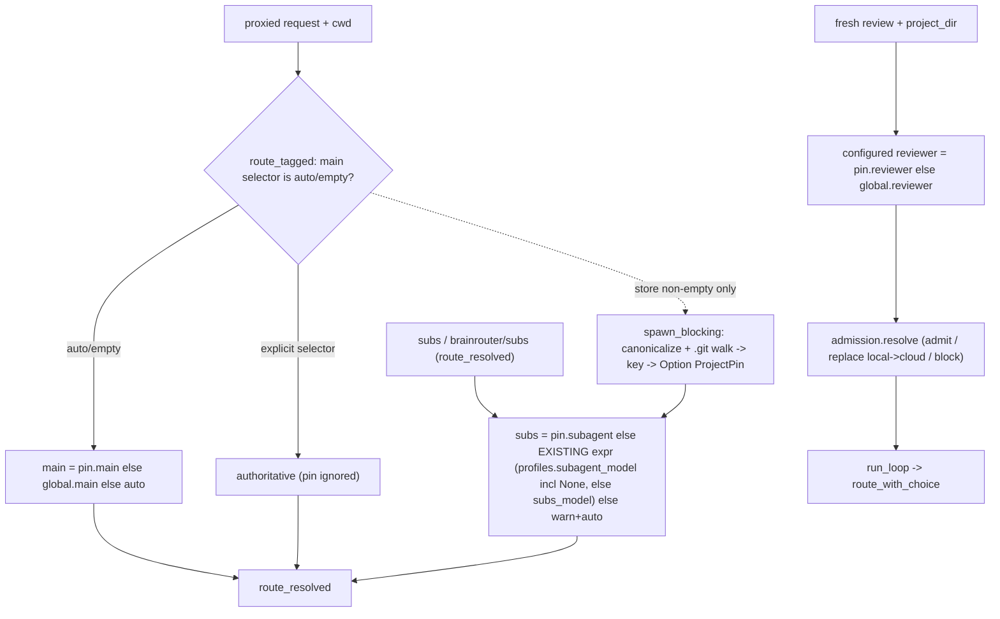

# Per-project model pin (dashboard/routing redesign — Phase 2)

> Session-folder working copy. On plan approval this is committed to `docs/design/per-project-model-pin.md` (Detailed-implementation step 1).

## Status

- **Workflow state:** `implementation-complete` (pending Step-9 mean review + deploy). The design passed the Dory readiness gate after **6 isolated critic/readiness passes** (round-6 verdict READY; blocking-finding trajectory 5→4→2→1→0→READY); the plan was approved and implemented in the ordered sequence below. Q1–Q3 were implemented as decided (scope selector; benchmarks honor pins for literal `auto`/`subs`; `?path=` resolver loopback-gated) — see Human approval. Live inference verification on Strix is deferred while the user's Strix model-use pause is in effect; all routing decisions are covered by model-free unit/UI tests.
- **Change classification:** **standard** (HankNDory rule 11). Changes model-routing *resolution* on the hot path (every proxied request + every review), adds a persisted local store, adds loopback-guarded HTTP endpoints. A defect breaks all local inference; the existing router/failover/subs/stream suites are a hard regression guard. Ships as its **own PR** with its **own Dory pass**.
- **Revisions:**
  - `v1 — 2026-09-26 — initial draft` from the Phase-2 seed (R9–R11, R-Phase2) in `docs/design/dashboard-nav-redesign.md` + first-hand code verification.
  - `v2 — 2026-09-26 — round-1 Dory-critic corrections.` Blocking: (B1) R10 split into **three role-specific contracts** — the universal precedence was false for reviewer (admission can override; no request-level explicit rung) and subagent (only `subs` aliases invoke the role); (B2) subagent fallback corrected to **preserve exact Phase-1 semantics** (a `ProfileStore` with `subagent_model=None` is authoritative `None`, not `subs_model`) so R9 holds; (B3) POST is **full-replacement** (all three role keys required, `null`=inherit) resolving the omit/null ambiguity; (B4) R11 satisfied by a **scope selector in the strip** (not a global-only strip + side panel); (B5) referenced-file set completed (`session.rs`, `escalation/mod.rs`, `admission.rs`, `inference_proxy.rs`). Important: normalization moved to `spawn_blocking` off the router path + persistence in `spawn_blocking` (I6); injectable normalizer so the R9 "no-fs" test can prove itself (I7); state file colocated with the **actual** `routing_state.json` via `default_config_path()` (I8); load-time validation/schema/prune + `0600` attribution fixed to `routing_profile.rs` (I9); benchmark pin-isolation **decided** (ignore pins) with both benchmark routing paths enumerated (I10); GET-gating language corrected (I11); absolute-path/UTF-8/`.git`-heuristic key rules (I12); connection-cwd invariant stated (I13); "pins select existing target" claim removed + per-role failure table (I14); UI `textContent`/hostile-string safety (I15). All drifted citations corrected.
  - `v3 — 2026-09-26 — round-2 Dory-critic corrections.` (B3′) POST uses a **presence-aware decoder** (each of `path`/`main`/`reviewer`/`subagent` must be *present*; missing→`400`, `null`→inherit, value→pin) since serde `Option` cannot distinguish omitted from null. (I6′/R9′) the normalization **predicate** is now exact — normalize only for original selectors `{""`, `auto`, `brainrouter/auto`, `subs`, `brainrouter/subs}` (skip named/`local`/`cloud`); the zero-fs guarantee is scoped to an **empty store** (an unpinned project is still normalized once when *another* project is pinned). (B4′) project-scope editing gets an explicit per-role **inherit⟷pin** affordance so editing one role never pins untouched inherited roles; preset hidden at project scope. (I10′) benchmark residual re-scoped (only `auto`→main and `subs`→subagent honor pins; `local`/`cloud` do not; the proxied path's cwd is the **daemon** process cwd) and the empty-cwd change dropped (it lost event `cwd`); Q2 reframed. (I6-rev) reviewer normalization is **synchronous at review creation** (off the proxy hot path) — accepted. Main failure table split by `ModelChoice`. Connection-cwd stated as a **contract**, not an invariant. Normalizer is an injectable `Arc<dyn Fn + Send + Sync>`.
  - `v4 — 2026-09-26 — round-3 Dory-critic+readiness corrections.` (R3-B1) added a server-backed **`GET /api/project-pin?path=<raw>`** resolver returning `{key, pin, global}` so the dashboard maps any recent/subdir/symlinked `cwd` to its **canonical** key + true pin state (a subdir/symlink scope can no longer falsely show "inherited" and clobber sibling roles on Save). (R3-B2) **Q2 decided** — accept the narrow edge case (no benchmark code change; hard-bypass deferred as it needs a trustworthy proxied-origin signal); corrected the stale "benchmarks ignore pins" alternative and the "only `auto` (not `local`/`cloud`) consults a main pin" wording. (R3-I1) mandated **one** POST decoder — a `deny_unknown_fields` struct of four **required** `serde_json::Value` fields (missing→`400`, unknown→`400`, `null`→inherit). (R3-I2) added a **lock-free `has_pins: AtomicBool`** gate so the Tokio worker/empty-store gate never acquire the store mutex; clarified the mutex is held across persistence but never during normalization. (R3-I3) the Save button keeps `onclick="saveRoutingProfile()"` (preserving the Phase-1 test) and **dispatches by scope**; inherited controls disabled, Pin seeds from global, Inherit serializes `null`. Nits: "empty store" wording; Human-approval/Status version bumps.
  - `v5 — 2026-09-26 — round-4 Dory-critic+readiness corrections + Strix pause.` (R4-B1, blocking) defined **subagent Pin when the global subagent is `None`** — no seed value exists, so entering Pin shows a required-unset state and disables Save until a valid explicit local model ID is entered. (R4-I1) specified the dashboard **scope-resolution state machine** — resolving-state + Save-disabled, stale/out-of-order response discard, `key:null`→"not a pinnable Git project", `key!=null&&pin==null`→creatable unpinned project, `resolve_key` bypasses `has_pins` so the first pin can be added, `URLSearchParams` encoding, dedup by canonical key. (R4-I2) **loopback-gated the `?path=` resolver** (arbitrary-path canonicalization = path-oracle + blocking-pool risk); the plain GET stays ungated; Q3 records the stronger risk. (R4-I3) added `has_pins` to the struct, replaced "checks map-emptiness" with the atomic read, put the whole normalize+lookup in `spawn_blocking`, and **narrowed the guarantee** to "the Tokio worker/empty-store gate never acquire the mutex" (a spawned lookup may wait behind a write's fsync), with `SeqCst` + first-add/last-remove visibility tests. **Strix model-use pause:** the live-verify section is now entirely model-free (status/GET APIs + unit/UI tests), with live inference verification explicitly deferred until the user lifts the pause.
  - `v6 — 2026-09-26 — round-5 Dory-critic+readiness corrections (no blocking).` (R5-I1) reconciled the GET-gating across the whole doc (Technical plan, Alternatives, impl step 5, Q3, decision log) and specified the guard/handler discriminator — **gate any query-bearing `GET /api/project-pin?...`** via `req.uri().query().is_some()`, handler requires exactly one `path` param (else `400`). (R5-I2) made scope resolution **generation-safe** (a monotonic resolution token, not raw-scope equality, so `A→B→A` is correct), clears the prior canonical key on resolution start, defined resolver-error/`key:null` behavior, and introduced **one authoritative Save-enabled predicate** the existing global load/save completions must also call. (R5-N1, nit) clarified `resolve` is **synchronous**; the proxy caller wraps it in `spawn_blocking`, reviewer creation calls it synchronously.

## Problem

Brainrouter routes every coding-agent request to a model using **one global profile** (the main/reviewer/subagent choices in `ProfileStore`). A user who works across several repositories cannot say "big local model for repo A, cloud for repo B" without flipping the global switch on every context change. The dashboard already receives each request's working directory (`cwd`), so the router *could* choose a model per project, but does not. We want a **per-project model pin**: a project inherits the global profile by default (zero setup, no behavior change for anyone who never pins), and the user may optionally pin a model — per role (main / reviewer / subagent) — for a specific project, keyed by the request's `cwd`. This is on the routing hot path, so correctness and a safe inherit-by-default are the whole game.

## Goals and non-goals

**Goals.**
- **R9** A project **inherits the global model profile by default** — a never-configured project behaves *exactly* as today (identical routing decisions; **zero** extra filesystem work when the pin store is empty).
- **R10** The user may **pin a model per role (main / reviewer / subagent) for a specific project**, keyed by `cwd`, with the **role-specific** resolution defined precisely in Requirements (a single "precedence for all roles" is *not* accurate — see B1).
- **R11** The dashboard model quick-switch (Phase-1 command strip) makes **inherited vs pinned** state visible for the selected scope, and makes it **visibly distinct** whether a change edits the **global** profile or **pins a specific project**.
- Preserve the reviewer-snapshot contract: a pin becomes the **configured** reviewer choice in the per-run snapshot at review creation (then subject to admission, exactly like the global reviewer); **continuations keep their original snapshot**.
- Additive and flag-safe: absent any pin, the system is identical to Phase 1.

**Non-goals.**
- Not per-project *anything else* (reasoning tier, review on/off, PR toggle, prompt-rewrite stay global). Only the three model roles are pinnable.
- No new *request-body* plumbing — `cwd` is already threaded into `Router::route_tagged` (`src/server.rs:1653-1656,1721-1724`) and into the reviewer loop as `project_dir` (`src/review/mod.rs`). We key off those. (Normalization to a repo-root *key* is derived from `cwd` on the router path inside `spawn_blocking`; see I6′.)
- Not pinning non-git or relative-path working directories — those inherit global (R-Phase2, I12).
- Not changing the global `ProfileStore`, the `/api/routing-profile` contract, or any Phase-1 UI behavior.
- **Benchmarks:** explicit-model benchmarks (the normal case, sent as `brainrouter/{model}`) are unaffected by pins; only the literal `auto` (→ main pin) and `subs` (→ subagent pin) selectors follow the same cwd resolution as any request. See I10/Q2 for the accepted edge case and the optional hard-bypass.

## Current system

All claims inspected first-hand at the cited paths (line numbers re-verified for v2).

### Routing hot path (`src/router.rs`)
- **`Router`** struct at `:85`; **`RouterArgs`** at `:114`; holds `profiles: Option<Arc<ProfileStore>>`, `local_models`, `subs_model`, `fallback_model`. Builders: **`with_profiles`** `:159`, accessor **`profiles()`** `:164`. Built in `daemon.rs` (`:362-380`) via `RouterArgs` + `.with_profiles(profiles)`.
- **`route_tagged`** (`:239-254`) — the single entry point both proxy protocols use (`src/server.rs:1653-1656` OpenAI, `:1721-1724` Anthropic) and the direct benchmark path uses (`src/benchmark_lab.rs:823-831`). Receives `cwd: String`. Its **only** model-resolution step (`:246-253`): if `request.model` is `""`/`"auto"`/`"brainrouter/auto"`, set it to `profiles.profile().main.selector()` (else `"auto"`). An **explicit** client model skips this block and stays authoritative — the "explicit wins" rung for **main**, already implemented.
- **`route_with_choice`** (`:257-272`) — reviewer-only entry. Takes a pre-built `choice: &ModelChoice`, sets `request.model = choice.selector()`, calls `route_resolved(..., apply_local_rewrite=false)`. The model is already explicit, so `route_resolved` **never consults the profile** — a pin resolved only in `route_tagged` would not reach the reviewer. **There is no request-level "explicit model" rung for the reviewer** (the reviewer request is internally constructed).
- **`route_resolved`** (`:274+`) dispatches on the resolved `request.model`. The **subs pool** arm (`:322-337`) is the only place the subagent model is resolved:
  ```rust
  if requested_model == "subs" || requested_model == "brainrouter/subs" {
      let subs = self.profiles.as_ref().map(|store| store.profile().subagent_model)
          .unwrap_or_else(|| self.subs_model.clone());
      if let Some(subs) = subs { /* route_local */ } else { /* warn + route_auto */ }
  }
  ```
  **Semantics that matter (B2):** when a `ProfileStore` **exists** and its `subagent_model` is `None`, the result is **`None`** (→ warn + auto); `self.subs_model` is consulted **only when no `ProfileStore` exists**. The daemon **always** attaches a store (`daemon.rs:171-175`), so in production the subs pool is `profile().subagent_model` (authoritative, may be `None`). `tests/routing_profiles_test.rs` verifies "clearing the pool routes through legacy auto, not the configured legacy pool" — this behavior must be preserved.
  A **named** model (not `auto`/`local`/`cloud`/`subs`) is routed authoritatively via the `local_models` arm / generic-named arm (`:~340-366`; the router permits **undiscovered** IDs, `:180-185`). The reviewer path never enters the subs arm (its selector is never `subs`).
- Downstream: `route_auto` (`:480`), `route_cloud` (`:512`), `route_local` (`:596-620`, direct picks pass `allow_fallback=false` so a failed explicit model **surfaces** the error), `try_llama_swap` (`:650`) act on an already-resolved model.

### Global profile (`src/routing_profile.rs`)
- **`ModelChoice`** enum at `:17`; `.selector()` (`:85-94`) → `auto`/`local`/`cloud`/`brainrouter/{id}`/`cloud/{id}`; `.validate()` (`:49-56`) + `validate_model_id` (`:97-110`) reject aliases/whitespace/**control** chars/overlong — but **not** HTML-significant chars like `<`/`>`/`&`/`"`, and **not** catalog membership (I14/I15). `ModelChoice` validates during **deserialization** (`:29-40`).
- **`RoutingProfile`** at `:125`: `{ preset, main: ModelChoice, reviewer: ModelChoice, subagent_model: Option<String> }`. Subagent is a bare **local model key** (`Option<String>`), not a `ModelChoice`, and has **no** automatic deserialize-time validation.
- **`ProfileStore`** at `:204+`: `Mutex<Preferences>` + optional path; `update_*` (`:~330-360`) validate → `atomic_write` → mutate memory. **`atomic_write`** (`:~380-406`) is the durability + **0600** precedent: `create_dir_all` → unique `.routing-<uuid>.tmp` with `.mode(0o600)` + `.create_new(true)` → `write_all` → `sync_all` → `rename` → cleanup-on-error. (It does **not** fsync the parent dir.)

### Persistence precedents
- **`src/review/runtime_state.rs`** (whole file): static `WRITE_LOCK: Mutex<()>` held across serialize → sweep orphaned temps → unique `.<name>-<uuid>.tmp` → `File::create` (**no explicit mode** — `:161-169`) → `write_all` → `sync_all` → `rename` → **parent-dir fsync**; corrupt/absent/unreadable → documented defaults; `schema_version` field; full test module.
- **The combined target:** `0600` + `create_new` from `routing_profile.rs:~386-395` **plus** the `WRITE_LOCK` + orphan-sweep + parent-fsync from `runtime_state.rs`.
- Sidecar paths: `routing_state.json` uses **`default_config_path().with_file_name(...)`** (`daemon.rs:171-172`); `managed_toolboxes.json` uses the **selected** `config_path.with_file_name(...)` (`daemon.rs:164-165`). Under `--config` these can differ. `default_config_path()` honors `$XDG_CONFIG_HOME`, falling back to `~/.config` (`src/config.rs:670-681`).

### Reviewer path (`src/review/`)
- **`ReviewService`** struct at `src/review/mod.rs:41`; `new` at `:62` (derives `preferences` from `router.profiles()`).
- **Fresh reviews** snapshot the config: `start_review` (`:113`; `config_snapshot = self.get_config()`, then `create_session_with_config(..., cwd, Some(config_snapshot))`, then `run_loop(..., &cwd, ...)`) and `start_review_async` (`:~455`, identical shape). `get_config()` (`:240`) = `self.preferences.review_config()`. The snapshot is **persisted into the session** by `create_session_with_config` (`src/session.rs:195-208`; snapshot field `:116-118`).
- **Continuations** (`continue_review`, `:298`) reuse `session.review_config.clone().unwrap_or_else(|| self.get_config())` and `session.cwd`. Comment `:309`: "Continuations retain the original reviewer, even after profile changes." So a reviewer choice baked into the snapshot at creation is what a continuation reuses — **no** re-resolution.
- **`run_loop`** (`src/review/review_loop.rs:52`) snapshots once: `configured = config.model_choice()?` (`:69`) → `admission.resolve(&configured)` (`:64-71`) → `choice`. **Admission can replace or block** the configured choice: a configured **local** reviewer may be **downgraded to cloud** when no memory permit is available, or the run blocked (`src/review/admission.rs:163-210`). `choice` is held for the whole run → `call_llm_for_review` (`:188,340`) → `route_with_choice(request, choice, ..., project_dir, ...)` (`:378`). There are exactly **three** `run_loop` callers (sync start, async start, continuation) — no fourth fresh-review bypass.
- **`ReviewConfig`** (`src/config.rs:430`): `{ max_iterations, forced_mode: String, forced_model: Option<String>, hankndory_integration, design_doc_path }`. `model_choice()` (`:488`) rebuilds the reviewer `ModelChoice` from `forced_mode`/`forced_model`. Overriding those two fields overrides the **configured** reviewer choice (pre-admission).
- **Fresh-review HTTP ingress** requires an **absolute** `cwd` (`src/escalation/mod.rs:179-213,240-291`; absolute-cwd checks `:194-209,272-282`).
- **Normalization precedents:** `review::context::resolve_project_root` (`src/review/context.rs:154-166`) and `review::design_doc::git_root` (`src/review/design_doc.rs:237-260`) shell out to `git rev-parse --show-toplevel` (empty cwd → `current_dir`); `git_root` → `None` for non-git; `resolve_project_root` falls back to the raw path.

### Server wiring (`src/server.rs`)
- **`AppState`** (`:108+`) holds `router`, `review_service`, etc. Routing endpoints reach the global store via `state.review_service.preferences()` (GET `/api/routing-profile` `:724-731`, POST `:733-751`, GET `/api/routing-models` `:754-756`). A generic `read_routing_json` helper deserializes POST bodies (`:~4038-4044`).
- **Destructive-request gate** (`:253-321`): a hard-coded set of prefixes/exact paths; runs **only** for classified-destructive requests; a non-loopback peer is blocked and browser Origin/Referer must be loopback. It keys almost entirely off `method == "POST"` — **no existing `DELETE` case**. GET is **never** gated (e.g. GET `/api/routing-profile` is ungated).
- **TCP bind is configurable** (`daemon.rs:151-153`) — not inherently loopback-only.
- **`cwd` derivation:** resolved **once per connection** in `spawn_blocking` — `peer_cwd(&addr)` for TCP (`:4259-4267`) and `cwd_from_pid(pid)` for UDS peer creds (`:4284-4303`) — then cloned for **every** request on that keep-alive connection and threaded to `route_tagged`. May be empty (`.unwrap_or_default()`). **Contract (I13):** the pin key is derived from this **connection-captured** cwd; the supported model is *one connection ⇒ one stable project cwd*. A client that `chdir`s while reusing a keep-alive connection (or an intermediary that owns the upstream connection) keeps routing under the captured cwd until it reconnects — the same capture semantics the dashboard's existing cwd features already rely on. This is a documented product **contract**, not a proven invariant.
- **`routing_events`** records `cwd` per event (`src/routing_events.rs:61`).

### Benchmarks (two routing paths — I10)
- **Direct:** `benchmark_lab.rs:823-831` calls `route_tagged` with `cwd = work_dir.to_string_lossy()`. `router_model_selector` (`:2879-2884`) returns `brainrouter/{model}` for a named model (explicit → pins skipped); of the literal selectors, only `auto` would consult a **main** pin (`local`/`cloud` are authoritative and skip the main block) and `subs` a **subagent** pin. Jobs are created beneath a **configurable** workspace (`config.rs:61-69`, jobs `benchmark_lab.rs:436-453`).
- **Proxied:** the benchmark inference proxy (`src/inference_proxy.rs`) is a **raw HTTP passthrough** (allow-list `/v1/chat/completions` + `/v1/models`, `proxy_request` `:133`) that forwards to **brainrouter's own socket** (`benchmark_lab.rs:978-981`). So sandboxed-agent benchmark traffic **re-enters `route_tagged`** with `cwd` = the proxy process's peer cwd. Same pin exposure as any agent request.

### Phase-1 dashboard (`src/escalation/templates/main_dashboard.html`)
- Command-control strip (`:261`): `#routing-preset`, `#main-backend`, `#main-model`, `#main-model-select`, `#save-routing-profile` (`:262-282`); reviewer/subagent in `#routing-expander` (`:295+`). `saveRoutingProfile()` (`:2929-2953`) POSTs preset + all three roles to `/api/routing-profile`. `renderPosture()` (`:2372`) builds HTML with `escHtml()` + `innerHTML`. No per-project concept today. The UI-test precedent `scripts/test-benchmark-ui.cjs` deliberately rejects `innerHTML` and tests hostile strings (`:34,104-120`).

### Tests (regression guard)
- `tests/routing_profiles_test.rs` (main/reviewer/subagent resolution incl. the "clearing pool → legacy auto" test), `tests/subs_routing_test.rs`, plus stream/failover suites. All construct `Router` **without** a project-pin store → must stay green unchanged.

## Requirements and acceptance criteria

- **R9 — inherit by default (no regression).** With an empty/absent pin store, `route_tagged`, the subs arm, and reviewer creation produce **identical** selectors to Phase 1, and the resolver does **zero** filesystem work. **Scope of the zero-fs guarantee (I6′):** it holds whenever the store is **empty** (the never-configured case); additionally, even with a non-empty store, normalization is skipped for any request whose original selector is **not** one of `{""`, `auto`, `brainrouter/auto`, `subs`, `brainrouter/subs}` (named/`local`/`cloud` never consult a main/subagent pin). An `auto`/`subs` request to an *unpinned* project while *another* project is pinned **is** normalized once (to discover it does not match) — accepted, not a regression, since routing decisions are unchanged. *AC:* an **injectable normalizer** (I7) proves normalization is **never** invoked when the store is empty, and **never** for named/`local`/`cloud` selectors even with a non-empty store; the existing router/subs/profiles/stream suites pass unchanged.
- **R10 — per-role pin (three role-specific contracts, B1/B2).**
  - **R10-main:** if the client selector is **not** `""`/`auto`/`brainrouter/auto`, it is authoritative (pin ignored). Otherwise: `pin.main` if set → else `global.main` → else `auto`. *AC:* four tests — explicit+pinned→explicit; auto+pinned→pin; auto+unpinned→global; auto+neither→`auto`.
  - **R10-subagent:** only a `subs`/`brainrouter/subs` request invokes the role; a named model bypasses it. Resolution: `pin.subagent` if the pin sets it → **else the existing expression verbatim** (`profiles.subagent_model` when a store exists, **including authoritative `None`**; only `subs_model` when no store) → unresolved `None` follows the existing warn-and-auto. *AC:* `subs`+pinned→pin.subagent; `subs`+unpinned+store-with-`Some`→that; `subs`+unpinned+store-with-`None`→warn/auto (the preserved Phase-1 test); named-model+pinned→pin ignored.
  - **R10-reviewer:** the reviewer has **no request-level explicit rung**. At **fresh-review creation**, the **configured** choice is `pin.reviewer` if set → else `global.reviewer`; this configured choice is then subject to `admission.resolve`, which may **admit, replace (local→cloud), or block** it. A pin does **not** bypass admission. Continuations reuse the stored snapshot. *AC:* fresh+pinned→snapshot `forced_mode/forced_model` equal the pin (asserted **pre-admission**); fresh+unpinned→global reviewer; continuation→original snapshot even if a pin is added afterward; a note-level test that admission still downgrades a pinned local reviewer when no permit.
- **R11 — inherited vs pinned + scope-distinct UI (B4/B4′).** The command-strip quick-switch gains a **scope selector** (`Global` default, or a specific project chosen from recent `cwd`s / existing pins / an absolute-path entry). At **project scope**, each role shows an explicit **inherit⟷pin** control: *inherited* displays the effective global value (visibly muted) but serializes **`null`**; *pinned* serializes the chosen value. Editing one role must **not** pin untouched inherited roles; toggling a role back to inherit clears it (`null`). The `routing-preset` control is **hidden/disabled** at project scope (a `ProjectPin` has no preset). **Save** at `Global` scope calls `/api/routing-profile` (unchanged), at project scope calls `/api/project-pin` (full replacement, inherited roles as `null`). A secondary Config list shows all pins for overview/removal. *AC:* the scope selector exists; a project scope shows per-role inherited/pinned state + values; editing only the reviewer leaves main/subagent as `null` (an inherited role follows a later global change); switching to Global shows/edits the global profile; Save routes to the correct endpoint; a UI test (mirroring `scripts/test-nav-ui.cjs`) asserts structure + inherited/pinned rendering + edit-one-role-preserves-others + hostile path/model strings render as inert text (I15).
- **R-Phase2 — project-key safety (I12).** The key is an **absolute repository-root identity** (canonical, UTF-8). *AC:* unit tests — empty cwd → global; **relative** path → global (never normalized against the daemon cwd); subdirectory → repo root; symlinked path → canonical root; git-worktree (`.git` **file**) → worktree root; non-git → global; malformed `.git` marker → treated as a root (documented heuristic); non-UTF-8 canonical path → unpinnable/global; vanished path → inert + removable by key; root `/` terminates the walk.

## Technical plan

Add a persisted **`ProjectPinStore`** (`src/project_pins.rs`) mapping an **absolute canonical repo-root key → `ProjectPin { main: Option<ModelChoice>, reviewer: Option<ModelChoice>, subagent: Option<String> }`**. Constructed once in `daemon.rs` beside the global profile (**same directory as `routing_state.json`**, via `default_config_path()` — I8), `Arc`-wrapped, threaded into the `Router` (`project_pins: Option<Arc<ProjectPinStore>>`, mirroring `profiles`). The reviewer path and HTTP handlers reach it via `router.project_pins()` (single owner, no `AppState`/`ReviewService::new` signature churn).

**Normalization predicate + offload (I6′).** In `route_tagged`, resolve the pin **once** — and only when the lock-free `has_pins` gate is set **and** the *original* request selector is in `{""`, `auto`, `brainrouter/auto`, `subs`, `brainrouter/subs}` (named/`local`/`cloud` selectors are authoritative and never consult a pin, so they skip normalization entirely — R9′). The `canonicalize` + `.git`-walk runs inside `tokio::task::spawn_blocking` (an owned `cwd` clone + `Arc<ProjectPinStore>` are `Send`; the store mutex is never held during fs work). The resolved `Option<ProjectPin>` is used for the main block (when the selector is auto/empty) **and** threaded into the **private** `route_resolved` for the subs arm (so a `subs` request, which skips the main block, still receives its pin without a second normalization). `route_with_choice` (reviewer) passes `None`. Public signatures (`route_tagged`, `route_with_choice`) are unchanged; only the private `route_resolved` gains one parameter, so existing tests/fixtures are untouched. **Reviewer normalization is synchronous at review creation** (off the proxy hot path; one `canonicalize` per fresh review, gated on a non-empty store) — the I6 offload is scoped to the proxy path only, because `start_review_async` is a synchronous method that cannot await `spawn_blocking` without a signature change (accepted; reviews are heavyweight and infrequent).



Each seam inherits global the instant the store is empty (R9). The dashboard adds a **scope selector** to the strip + `GET/POST/DELETE /api/project-pin` (POST/DELETE loopback-guarded; the plain no-query GET ungated like GET `/api/routing-profile`, the **`?path=` resolver loopback-gated** — I11/R4-I2). Persistence (POST/DELETE) and the `?path=` resolver's normalization run in `spawn_blocking` (I6).

## Architecture and flows

### Data model (`src/project_pins.rs`)
```rust
pub struct ProjectPin { pub main: Option<ModelChoice>, pub reviewer: Option<ModelChoice>, pub subagent: Option<String> }
pub struct ProjectPinStore { state: Mutex<HashMap<String, ProjectPin>>, has_pins: AtomicBool, path: Option<PathBuf>, normalizer: Normalizer }
```
On-disk: `{ "schema_version": 1, "pins": { "<abs-repo-root>": { "main": <ModelChoice?>, "reviewer": <ModelChoice?>, "subagent": <string?> } } }`, `#[serde(deny_unknown_fields)]` at the top level. `Normalizer = Arc<dyn Fn(&str) -> Option<String> + Send + Sync>` (default = the real `project_key`; tests inject a counting/fake closure — I7).

### Project-key normalization (R-Phase2, I12) — one function, read + write identical
```
fn project_key(cwd: &str) -> Option<String>:
    if cwd.is_empty() || !Path::new(cwd).is_absolute(): return None   // empty or relative -> global (never resolve vs daemon cwd)
    let canon = std::fs::canonicalize(cwd).ok()?                      // resolve symlinks + absolutize; failure -> None
    let mut dir = canon.as_path();
    loop:
        if dir.join(".git").exists(): return dir.to_str().map(str::to_owned)  // repo root; worktree .git is a FILE; None if non-UTF-8
        match dir.parent(): Some(p) => dir = p; None => return None    // root '/' -> None (global); terminates
```
- **`.git` is a deliberate marker heuristic** — presence of a `.git` entry (file or dir) marks a root; we do **not** parse git internals. A malformed `.git` yields a normal key that routes like any other. Documented.
- **Absolute-only:** a relative route `cwd` (or POST `path`) never normalizes against the daemon's own cwd (I12); relative route cwd → global, relative POST path → `400`.
- **UTF-8 key:** a non-UTF-8 canonical path is unpinnable (→ global). The map/JSON keys are `String`.
- **Matching is exact repo-root equality** — normalization collapses any subdir/symlink spelling to the same canonical root, so a request from a subdir matches a repo-level pin without an ancestor-walk over the map.
- **R9 short-circuit (I7):** `resolve(cwd)` reads the lock-free `has_pins` atomic (`SeqCst`) first and returns `None` **before** any mutex/normalizer/canonicalize when it is false. `resolve` is itself **synchronous**; the **proxy caller** (`route_tagged`) wraps the whole `resolve` call in one `spawn_blocking` when `has_pins` is true, whereas reviewer creation calls it synchronously (R5-N1). The injected counter proves zero normalizer calls when `has_pins` is false and for named/`local`/`cloud` selectors. **`resolve_key` (the GET `?path=` resolver) always normalizes, bypassing the `has_pins` short-circuit** (R4-I1), so the *first* pin can be created in an empty store.

### Resolution seams (exact)
- **Main** — `route_tagged` (`:246-253`), inside the existing `if matches!(...auto/empty...)`:
  `request.model = pin.and_then(|p| p.main).map(sel).or_else(|| global.main.map(sel)... ).unwrap_or("auto")` (explicit selectors already skip this block).
- **Subagent** — `route_resolved` subs arm (`:322-337`):
  `let subs = pin.and_then(|p| p.subagent).or_else(|| self.profiles.as_ref().map(|s| s.profile().subagent_model).unwrap_or_else(|| self.subs_model.clone()));` — i.e. the pin overrides **only when it sets subagent**; otherwise the **unchanged Phase-1 expression** runs (B2).
- **Reviewer** — in `ReviewService`, at `start_review` and `start_review_async`, right after `config_snapshot = self.get_config()` and **before** `create_session_with_config`/`run_loop`:
  `if let Some(rev) = self.router.project_pins().and_then(|s| s.resolve(cwd)).and_then(|p| p.reviewer) { config_snapshot.forced_mode = rev.backend().into(); config_snapshot.forced_model = rev.model().map(str::to_owned); }`.
  The snapshot is persisted into the session, so `continue_review` reuses it; `admission.resolve` in `run_loop` then applies its downgrade/block to the **configured** (pinned) choice exactly as for the global reviewer. Normalization here is **synchronous** (both `start_review` and the synchronous `start_review_async` call `resolve(cwd)` directly), accepted as off-hot-path (I6-rev).

### Concurrency, consistency, errors (I6/I9)
- `ProjectPinStore` guards the map with a `Mutex` and maintains a **lock-free `has_pins: AtomicBool`** (`SeqCst`; set on `load` and after every mutation, under the write lock). The **Tokio worker and the empty-store gate never acquire the store mutex** — `route_tagged`/the subs arm read `has_pins` lock-free; false → skip entirely (R9). When `has_pins` is true, the **proxy caller** runs the whole synchronous `resolve` in `spawn_blocking`, where the brief map-read lock *may* wait behind an in-flight write's `sync_all` (bounded, off the worker — not a categorical "never waits"). **The mutex is never held during normalization; mutation serialization intentionally holds it across durable persistence** — mutations (set/remove) do a locked read-modify-write on a cloned map → validate → `atomic_write(snapshot)` → on success commit the clone, then publish `has_pins`, then unlock (a failed write leaves both unchanged), so concurrent **distinct-key** updates never lose a committed key. *Tests:* first-add makes `has_pins` observably true; last-remove makes it false.
- **Writer** = `routing_profile.rs`'s `0600` + `create_new` **combined with** `runtime_state.rs`'s `WRITE_LOCK` + orphan-temp sweep + **parent-dir fsync**.
- **Load** (`load(path)`): absent/unreadable/corrupt → **empty map** (warn, inherit-global); **unsupported `schema_version` → empty map** (fail-safe); every loaded `subagent` string validated via `validate_model_id` (invalid → drop that role); every loaded `ModelChoice` is validated by its deserializer; **all-`None` entries pruned** on load and after every mutation.
- A pin only **selects** a routing target; it accepts the **same unverified explicit IDs** as global routing (`validate_model_id` is syntax-only; the router permits undiscovered IDs, `:180-185`) — a bad pinned model fails/escalates exactly as a bad global choice would (I14).

### HTTP API (via `router.project_pins()`)
- **`GET /api/project-pin`** → `{ "pins": { "<key>": {main?,reviewer?,subagent?} }, "global": <RoutingProfile>, "cloud_enabled": bool }`. **`GET /api/project-pin?path=<raw>`** resolves a raw path (a recent event `cwd`, a subdir, or a symlinked spelling) server-side in `spawn_blocking` → `{ "key": <canonical|null>, "pin": <entry|null>, "global": <RoutingProfile> }` (R3-B1). `key != null, pin == null` = a real **unpinned** project (createable); `key == null` = not a pinnable Git project. The plain `GET /api/project-pin` (no query) is **ungated** (read-only, consistent with GET `/api/routing-profile`). The **`?path=` resolver is loopback-gated (R4-I2)** — it canonicalizes an **arbitrary caller-supplied** path (a filesystem path-oracle + blocking-pool vector), so it requires a loopback peer (non-loopback `?path=` → rejected, with a test).
- **`POST /api/project-pin`** — **full replacement via one mandated presence-aware decoder (B3′/R3-I1)**. The body is a `#[serde(deny_unknown_fields)]` struct with **four required, non-`Option` `serde_json::Value` fields** `{ path, main, reviewer, subagent }`: a **missing** field is a serde error → `400`; an **unknown** field → `400`; an explicit `null` deserializes to `Value::Null` (present). Then `path` must be `Value::String`, non-empty, **absolute** → normalized to the key (`400` if not-a-string / relative / non-git / non-UTF-8); each role is `Value::Null` (= inherit) or — main/reviewer — `serde_json::from_value::<ModelChoice>` (its validating deserializer rejects bad backend/model + nested unknown fields, `routing_profile.rs:29-40`), or — subagent — a non-empty `Value::String` through `validate_model_id` (reject non-string/empty). The whole entry is **replaced** atomically under the store lock; all-`null` → **remove**. Returns `{ "pins": ..., "key": "<key>" }`. **Loopback-guarded**. *Concurrency:* **last-writer-wins per key** (two tabs GET→POST the same key: later wins; single-user, no ETag); distinct-key writes never lose each other (locked RMW). *Tests:* unknown top-level field → `400`; omit each of the four keys → `400`; `path` empty/null/non-string → `400`; primitive/array `main`/`reviewer` → `400`; non-string/empty `subagent` → `400`; explicit `null` per role → inherit; one-role-changed preserves the others.
- **`DELETE /api/project-pin`** — body `{ "key": "<exact repo-root from GET>" }` → remove the entry (pure map delete; does **not** require the path to exist — the stale-entry cleanup path). Idempotent (removing an absent key returns `200` with the unchanged map). **Loopback-guarded** (new `DELETE` clause in the gate).

### Dashboard (R11, B4/I15)
- **Strip scope selector:** a `<select id="pin-scope">` = `Global` (default) + one option per project (recent `cwd`s from the events feed ∪ existing pin keys; events without a `cwd` are not offered) + an "Add by path…" absolute-path entry. **Resolution state machine (R3-B1/R4-I1/R5-I2):** selecting a non-Global scope **clears** the prior canonical key + pin snapshot, enters a **resolving** state, and issues **`GET /api/project-pin?path=<raw>`** (query built with `URLSearchParams`) tagged with a **monotonically increasing resolution token**; a response is applied **only if its token is the latest** (this handles `A→B→A`, which equality-on-raw-scope alone would not). On a resolver error or non-loopback `403`, the resolved state stays cleared, the error is shown, and no POST is attempted. The UI keys everything off the returned canonical `key` (dedup by canonical key): `key != null && pin == null` = a real **unpinned** project (createable — its first Save adds the entry); `key != null && pin != null` = show the true per-role pinned/inherited state; `key == null` = **"not a pinnable Git project"** (Save disabled, never POSTs). `renderScope()` shows per-role inherit⟷pin controls: an inherited role's `backend`/`model` inputs are **disabled**, showing the muted global value; **Pin** enables them seeded from the effective global value; **Inherit** serializes `null`. **Subagent seeding (R4-B1):** main/reviewer Pin seed from their global `ModelChoice`; subagent Pin seeds from the global ID **only when `Some`** — when the global subagent is `None` (the "Unconfigured (auto)" state, `routing_profile.rs:125-131`, `main_dashboard.html:2866-2876`), entering Pin shows a **required-unset** state and disables Save until a valid explicit local model ID is entered (empty → `400`). **Single Save-enabled predicate (R5-I2):** Save is enabled **iff** `not busy && scope resolved (Global, or a project with a non-null canonical key) && every pinned role valid (no required-unset subagent)`; the existing global load/save completions (`main_dashboard.html:2881-2887,2929-2952`) must call this predicate instead of unconditionally re-enabling the button. **Save handler (R3-I3):** the inline button stays `onclick="saveRoutingProfile()"` (preserving `test-nav-ui.cjs:75`); `saveRoutingProfile()` **dispatches on `#pin-scope`** — `Global` runs its existing global-save branch unchanged; a project builds the full-replacement body from the returned canonical `key` + per-role controls (inherited → `null`) and POSTs `/api/project-pin`, then refreshes from the POST's returned `key`. *UI tests:* `A→B→A`; resolver `403`/failure; a late global-profile completion; toggling a required-unset subagent Pin back to Inherit.
- **Config "Project model pins" list:** read-only table of all pins (basename + full-path tooltip) with per-role inherited/pinned badges + a Remove (DELETE) button — overview/cleanup.
- **Safety:** all project paths and model IDs are rendered with `textContent` / safe attribute assignment (no `innerHTML` interpolation of untrusted strings). Hostile-string fixtures assert inert text.

## Alternatives considered

- **One universal precedence "explicit > pin > global > auto" for all roles.** *Rejected (B1):* false for the reviewer (no request-level explicit rung; admission can override the configured choice) and subagent (only the `subs` alias invokes the role; the "explicit" case is a *named model* that bypasses the role entirely). Replaced by three role-specific contracts.
- **Subagent fallback `pin → global → config.subs_model`.** *Rejected (B2):* changes Phase-1 behavior — a store with `subagent_model=None` is **authoritative `None`** today (→ auto), not `subs_model`. Preserving the existing expression verbatim keeps R9.
- **Normalize the key with `git rev-parse --show-toplevel` (like `context.rs`/`design_doc.rs`).** *Rejected for the hot path:* a subprocess fork+exec per request while any pin exists. The `.git`-walk is fork-free, cheap, and (I6) offloaded to `spawn_blocking`. The precedent functions remain fine for the reviewer/design paths.
- **Key by raw/canonical `cwd` (no repo-root walk).** *Rejected:* R-Phase2 requires a repository-root identity; a subdir key splits one project and misses repo-level pins.
- **"Nearest ancestor in the map" matching.** *Deferred:* repo-root normalization already collapses subdirs, so exact match suffices; ancestor-over-map adds untested "most specific wins" semantics.
- **Cache the normalized key per connection (rejected in v1 as value-staleness).** *Corrected (I6):* a cached **key** is not a cached **pin value** — a per-connection key + live map lookup would be sound. Not chosen only because `spawn_blocking`-per-resolution is simpler and avoids threading a key beside `cwd`; recorded as a viable alternative if profiling ever shows the offload matters.
- **Strip stays global-only + a separate project panel (v1).** *Rejected (B4):* contradicts R11, which requires the **quick-switch** to show inherited/pinned + scope. Replaced by the in-strip scope selector.
- **Global-only strip with R11 formally amended.** *Available fallback* if the creator prefers it (requires amending R11 + the Phase-2 seed). Recorded, not chosen.
- **A hard benchmark pin-bypass.** *Deferred (I10′/R3-B2):* would need a **trustworthy benchmark-origin signal** for the **proxied** path (the inference proxy is a transparent forward with no origin flag), touching `inference_proxy.rs`/`server.rs`/`router.rs`/`benchmark_lab.rs`. Out of scope for this PR; recorded for a future increment if alias-selector benchmark reproducibility becomes a concern. **Decision:** benchmarks follow the same cwd resolution as any request — named-model benchmarks (the normal case) are explicit and unaffected; only literal `auto`/`subs` under a pinned dir honor pins (Q2 accepted).
- **Separate `Arc<ProjectPinStore>` on `AppState` + `ReviewService`.** *Rejected:* the `Router` reaches all seams and is held by both; one owner via `router.project_pins()` minimizes churn.
- **Pin subagent as full `ModelChoice`.** *Rejected:* mirrors the global `Option<String>`; recorded limitation (no cloud/auto subagent pin).
- **Loopback-gate the plain GET too.** *Available option (I11/R4-I2):* the `?path=` resolver **is** gated (decided, R4-I2); the plain no-query GET stays ungated for consistency with GET `/api/routing-profile`. Gating the plain GET as well is offered to the creator (Q3), not chosen by default.

## Detailed implementation

Ordered; each step compiles and keeps the suite green.

1. **`src/project_pins.rs` (create)** + `pub mod project_pins;` in `src/lib.rs`. `ProjectPin`, `ProjectPinStore { memory(), memory_with_normalizer() [test], load(path), has_pins()->bool [lock-free AtomicBool], resolve(cwd)->Option<ProjectPin> (has_pins short-circuit then normalizer+lookup), resolve_key(path)->Option<String> [for GET ?path=], set(path, ProjectPin), remove(key), snapshot() }`, `project_key(cwd)->Option<String>`, and the combined atomic writer. Load-time validation/schema/prune (I9). *Tests:* normalization matrix (I12), atomic round-trip, corrupt/absent/bad-schema → empty, injected-normalizer zero-calls-when-`has_pins`-false + never-for-named/local/cloud (I7), invalid-subagent drop, all-None prune, concurrent distinct-key no-lost-update (I9). **Commit this doc to `docs/design/per-project-model-pin.md`.**
2. **`src/router.rs`** — add `project_pins: Option<Arc<ProjectPinStore>>` + `with_project_pins` builder + `project_pins()` accessor (mirror `:159,164`). Resolve the pin once in `route_tagged` (spawn_blocking, gated) → edit the **main** block (`:246-253`) → thread `Option<ProjectPin>` into the private `route_resolved` → edit the **subs** arm (`:322-337`) per B2. `route_with_choice` passes `None`. *Tests:* R10-main + R10-subagent rungs in `tests/routing_profiles_test.rs` / `tests/subs_routing_test.rs` (incl. the preserved "clearing pool → auto" case with a pin absent, and explicit-main-skips-normalization I7).
3. **`src/review/mod.rs`** — `apply_reviewer_pin(&mut ReviewConfig, cwd)` from `self.router.project_pins()`, called in `start_review` + `start_review_async` after `get_config()`. `continue_review` untouched. *Tests:* pin sets `forced_mode/forced_model`; no-op unpinned; stored `session.review_config` carries the pinned reviewer (continuation inheritance); note-level admission-downgrade-still-applies.
4. **`src/daemon.rs`** — `let project_pins = Arc::new(ProjectPinStore::load(default_config_path().with_file_name("project_pins.json")));` beside the profile load (`:171`), add `.with_project_pins(project_pins)` to the `Router::new` chain (`:362-380`). No `AppState`/`ReviewService::new` change. **Benchmarks (I10′/R3-B2 — decided: no benchmark code change):** named-model benchmarks send `brainrouter/{model}` (explicit → no pin); only literal `auto` (→ main) / `subs` (→ subagent) under a pinned dir honor pins (accepted, Q2). The hard-bypass is **out of scope** for this PR (needs a trustworthy proxied-origin signal — see Alternatives).
5. **`src/server.rs`** — add `GET`/`POST`/`DELETE "/api/project-pin"` near `:724`, via `state.router.project_pins()`; persistence + the `?path=` resolver's normalization in `spawn_blocking`. Extend the gate (`:253-321`): add `path == "/api/project-pin"` to the `POST` set, `|| (method == "DELETE" && path == "/api/project-pin")`, **and `|| (method == "GET" && path == "/api/project-pin" && req.uri().query().is_some())`** so *any* query-bearing resolver GET is loopback-gated (R4-I2/R5-I1). The handler then requires **exactly one** decoded `path` query param (missing/duplicate/unknown query params → `400`). *Tests:* POST full-replace/validate/prune-empty; DELETE by key (absent-key idempotent); plain no-query GET pins+global readable (incl. non-loopback); non-loopback POST/DELETE **and** query-bearing GET blocked; loopback resolver with exactly one `path` succeeds; malformed/duplicate query → `400` (still gated).
6. **`src/escalation/templates/main_dashboard.html`** — scope selector + `renderScope()` + scope-aware save + the Config pins list + `loadProjectPins/renderProjectPins/saveProjectPin/removeProjectPin`, all `textContent`-based (I15). Keep every Phase-1 id/handler intact.
7. **`scripts/test-project-pins-ui.cjs` (new, mirroring `test-nav-ui.cjs`/`test-benchmark-ui.cjs`)** — structural (scope selector, pins list ids unique) + behavioral (inherited/pinned rendering; scope-aware save target) + **hostile-string inert-text** assertions (I15).
8. **Docs** — update `docs/design/dashboard-nav-redesign.md` Phase-2 status + this doc's Status/Dory records.

**Checkpoints:** after step 2, the R10-main/subagent tests + existing suites green; after step 5, endpoint + gate tests green; after step 7, `node --test scripts/*.cjs` + `bash scripts/check-html-js.sh` green.

## Testing and evaluation

- **R10 (Rust, primary guard):** the role-specific rungs enumerated in R10's AC (main/subagent in the routing tests; reviewer at the `apply_reviewer_pin`/snapshot level, isolated from admission; one admission-still-downgrades note test).
- **R-Phase2 normalization (Rust):** the I12 matrix incl. relative-path→global, root-termination, malformed `.git`, non-UTF-8, symlink, worktree file, vanished-path.
- **R9 (Rust):** injected-normalizer zero-calls when store empty **and** when the main selector is explicit; full existing suites green unchanged.
- **Persistence (Rust):** atomic round-trip; corrupt/absent/bad-schema → empty; invalid-subagent drop; all-None prune; concurrent distinct-key no-lost-update; `0600` on the written file.
- **State location (Rust):** with `$XDG_CONFIG_HOME` set and with a custom `--config`, the pin file colocates with `routing_state.json` (I8).
- **Endpoints + gate (Rust):** POST one-decoder (missing/unknown key → `400`; type/empty validation; full-replace/validate/prune); DELETE by key (path-absent OK, idempotent); GET pins+global; **GET `?path=` resolves a subdir/symlink to the canonical key + pin, returns `key:null` for non-git and `key!=null,pin:null` for an unpinned real repo, and is loopback-gated (non-loopback → rejected)** (R3-B1/R4-I2); non-loopback POST **and** DELETE blocked; plain GET readable.
- **Benchmark behavior (Rust, I10′):** assert named-model benchmarks (`brainrouter/{model}`) never consult a pin (explicit). Document + test the residual accurately: only `auto` (→ main pin) and `subs` (→ subagent pin) selectors honor pins; `local`/`cloud` do **not** (authoritative). The **direct** path keys off the benchmark `work_dir`; the **proxied** path keys off the *daemon process* cwd (the inference proxy runs inside brainrouter, so the captured UDS peer cwd is brainrouter's, not `/work` — `inference_proxy.rs:133`, `benchmark_lab.rs:978-981`). If the optional hard-bypass is taken, test that proxied `auto`/`subs` skip pins too.
- **R11 UI (Node synthetic DOM):** structure + inherited/pinned rendering + scope-dispatched save (Global vs project) + **editing one role leaves the others inherited (`null`)** + a subdir/symlink scope resolving to an existing pin shows the true pinned state + **subagent Pin with global subagent `None` shows required-unset and disables Save** (R4-B1) + **resolver resolving-state / stale-response discard / `key:null` not-pinnable** (R4-I1) + hostile-string inert text; a11y/viewport remain the documented manual checklist (same carve-out as Phase 1).
- **Full gate:** `cargo test --locked -- --test-threads=1`, `cargo clippy --locked --all-targets`, `bash scripts/check-html-js.sh`, `node --test scripts/*.cjs`.
- **Live verify on strix — ENTIRELY MODEL-FREE (the user has PAUSED all Strix model use until they lift it).** Verify routing **decisions** without loading any model: the Rust unit tests (precedence/normalization/endpoint-shape), `bash scripts/check-html-js.sh` + the UI test, and read-only API checks that do **not** trigger inference — `GET /api/project-pin` (+ the loopback `?path=` resolver), `GET /api/routing-profile`, and the routing/inference-**status** APIs — confirming the resolver's chosen model id/label and that a pin persists across `systemctl --user restart brainrouter` (a model-free proxy restart). **Do NOT** send `/v1/chat/completions` or `/v1/messages` (they can make llama-swap load a model), start Server-Mode, or run benchmarks. **Live inference verification is deferred until the user lifts the Strix model-use pause;** the design's routing decisions are fully covered by the model-free checks above + the Rust unit tests, so nothing blocks review/approval on it.

## Security, privacy, reliability, and operations

- **Attack surface (I11/R4-I2):** `POST`/`DELETE /api/project-pin` join the existing loopback + CSRF-Origin gate (the `DELETE` clause is new; a test proves it). The **`?path=` resolver is also loopback-gated** because it canonicalizes an arbitrary caller-supplied path — a path-oracle (probe which paths are Git repos + their symlink targets) and a blocking-pool vector; a non-loopback `?path=` request is rejected (test). The **plain `GET /api/project-pin`** (no query) stays ungated (consistent with GET `/api/routing-profile`), exposing already-known pin/repo paths — same class as the existing event-`cwd` APIs. The TCP bind is configurable (`daemon.rs:151-153`).
- **Data:** one new local file `project_pins.json` beside `routing_state.json` (honoring `$XDG_CONFIG_HOME`), `0600`, containing local repo paths + model ids — no secrets. Durability = `routing_profile.rs` + `runtime_state.rs` combined.
- **Reliability:** corrupt/absent/bad-schema → inherit-global; durable-before-visible writes; single-writer daemon documented. **Pins accept unverified explicit IDs (I14)** — a bad pinned model fails/escalates like a bad global choice. Per-role failure behavior:

  | Pinned `ModelChoice` (role) | Behavior on failure |
  |------|------|
  | main `Auto` | classifier picks cloud **or** local; may never contact Manifest; cloud→local fallback only on the cloud branch (`route_auto` `:480-506`, `route_cloud` `:510-593`) |
  | main `Cloud{None}` / `Cloud{id}` | Manifest, then local fallback (`route_cloud` `:510-593`) |
  | main `Local{None}` (default) | routes the configured fallback model directly (`:246-253` → `route_local`) |
  | main `Local{id}` (explicit) | error surfaces, **no** fallback (`route_local` `allow_fallback=false`, `:596-630`) |
  | subagent (`subs` pool) | subs model missing → error, no fallback (`:326-333`) |
  | reviewer | admission blocks / model errors → review **escalates to human** (existing admission/loop) |

- **Observability:** routing events already carry `cwd` + effective model, so a pinned route is visible in the Sankey/stream with no new telemetry.

## Rollout, migration, and rollback

- Additive; no migration. Absent `project_pins.json`, behavior == Phase 1. Own PR after its own Dory pass + mean code review.
- **Deploy runbook (Mac worktree cannot push to GitHub — 403; deploy via strix):** back up `~/.local/share/brainrouter/benchmarks.sqlite3`; commit via `printf '%s\n' … > /tmp/m.txt && git commit -F /tmp/m.txt` (heredoc/`-m` corrupts the `Co-authored-by: … <…>` trailer); `git push ssh://papa@192.168.1.252/home/papa/ai/projects/brainrouter HEAD:refs/heads/<branch>`; on strix `git checkout master && git merge --ff-only <branch> && ~/.cargo/bin/cargo build --release --locked && systemctl --user restart brainrouter && curl -s 127.0.0.1:9099/health`; then `git push origin master` + branch **from strix**. Keep Mac worktree = strix master = GitHub synced.
- **Rollback:** revert the PR + delete `project_pins.json`. No global state is touched → exact Phase-1 behavior.

## Risks and mitigations

| Risk | Severity | Mitigation |
|------|----------|------------|
| Pin resolution regresses the hot path for un-pinned users | High | Empty-store short-circuit before the normalizer; **injectable-normalizer** zero-call test (I7); existing suites |
| Subagent fallback silently changes Phase-1 semantics | High | Preserve the existing expression verbatim; the "clearing pool → auto" test with pin absent (B2) |
| Reviewer pin misses the snapshot or bypasses admission safety | High | Applied at both fresh-creation sites, pre-admission; continuation inheritance tested; pin is *configured*, admission still governs (B1) |
| Key normalization skew read vs write | High | One `project_key` fn; matrix tests (I12) |
| Blocking fs on the async router | Med | `spawn_blocking`, gated on non-empty store, mutex not held during canonicalize (I6) |
| POST update semantics ambiguous / lost updates | Med | Full-replacement + `deny_unknown_fields` + atomic locked RMW; UI GETs before POST (B3) |
| New `DELETE` slips the gate | Med | Explicit `DELETE` clause + non-loopback-blocked test |
| State file diverges from the global profile under `--config`/XDG | Med | Colocate via `default_config_path()` like `routing_state.json`; XDG/`--config` test (I8) |
| Benchmarks contaminated by a pin | Low/Med | Named-model benchmarks are explicit (`brainrouter/{model}`) → unaffected; only literal `auto`/`subs` under a pinned dir honor pins (accepted, Q2); optional hard-bypass recorded (I10′) |
| GET exposes repo paths on a non-loopback bind | Low/Med | Same class as existing event-`cwd` APIs; optional GET-gating recorded (I11) |
| Stored/local XSS from paths/model IDs in the panel | Med | `textContent`/safe attrs; hostile-string inert-text tests (I15) |
| Stale key after a repo is deleted/moved | Low | Inert; removable by `DELETE {key}` without the path existing; no auto-prune |

## Open questions

- **Q1 (UI, material — resolved by design, needs creator sign-off):** v2 satisfies R11 literally via an in-strip **scope selector** (Global vs a chosen project). The recorded alternative is a global-only strip with R11 formally amended. Confirm the scope-selector reading.
- **Q2 (benchmarks — DECIDED, creator may override):** benchmarks follow the same cwd resolution as any request. Named-model benchmarks (the normal case, `brainrouter/{model}`) are explicit → unaffected. Only literal `auto` (→ main) / `subs` (→ subagent) under a pinned dir honor pins (direct path keys off `work_dir`; proxied path keys off the daemon cwd — rarely under a user pin). **Decision: accept this narrow edge case; no benchmark code change.** A hard benchmark-origin bypass is a deferred future increment (needs a trustworthy proxied-origin signal). Creator: override if you regularly benchmark literal alias selectors.
- **Q3 (GET gating — DECIDED, R4-I2):** the **`?path=` resolver is loopback-gated** (it canonicalizes arbitrary caller paths — a path-oracle + blocking-pool risk stronger than passive disclosure); the **plain GET** (existing pins/global) stays ungated, consistent with GET `/api/routing-profile`. Creator: gate the plain GET too if even known-path disclosure on a non-loopback bind is unacceptable.
- **Q4:** subagent pins are `Option<String>` (local pool key only). Accept "no cloud/auto subagent pin"?
- **Q5:** store cleanup = manual `DELETE` + inert stale entries, no auto-prune on load. Accept, or add a "prune missing" action?

## Decision log

- **Only model roles are per-project; everything else global.** Inherited nav-redesign decision. 2026-09-26.
- **R10 is three role-specific contracts, not one precedence** (main explicit-bypass→pin→global→auto; subagent only via `subs` alias, pin→existing-expr; reviewer configured pin→global then admission). 2026-09-26 (v2, B1).
- **Subagent fallback preserves the exact Phase-1 expression** (store `None` is authoritative). 2026-09-26 (v2, B2).
- **POST is full-replacement (all three role keys, `null`=inherit, all-null=remove).** 2026-09-26 (v2, B3).
- **R11 via an in-strip scope selector** (global strip + side panel rejected). 2026-09-26 (v2, B4; pending Q1).
- **Key = absolute canonical repo-root via canonicalize + `.git`-walk; relative/non-git/non-UTF-8 → global; `.git` is a heuristic marker.** 2026-09-26 (v2, I12).
- **Proxy-path and HTTP-resolver normalization run in `spawn_blocking`; reviewer resolution is synchronous. The mutex is never held during normalization but is intentionally held across durable persistence.** 2026-09-26 (v2, I6; refined v5/v6, R4-I3/R5-N1).
- **State file colocated with `routing_state.json` via `default_config_path()`.** 2026-09-26 (v2, I8).
- **Writer = `routing_profile.rs` (0600/create_new) + `runtime_state.rs` (lock/sweep/parent-fsync); corrupt/bad-schema → inherit-global; loaded subagent IDs validated; all-None pruned.** 2026-09-26 (v2, I9).
- **Benchmarks: named-model benchmarks unaffected (explicit); literal `auto`/`subs` follow cwd resolution.** No benchmark code change by default; optional hard-bypass recorded. 2026-09-26 (v3, I10′; pending Q2).
- **GET: plain no-query GET ungated (like routing-profile GET); the `?path=` resolver loopback-gated** (v2 "GET ungated" *superseded* v5/R4-I2 for the resolver). 2026-09-26.
- **Pins accept unverified explicit IDs, like global routing** (per-role failure table). 2026-09-26 (v2, I14).
- **UI renders untrusted strings via `textContent`.** 2026-09-26 (v2, I15).
- **POST decoded with a presence-aware decoder** (missing key→`400`, `null`→inherit, value→pin); serde `Option` alone is insufficient. 2026-09-26 (v3, B3′).
- **Normalization predicate:** only original selectors `{""`,`auto`,`brainrouter/auto`,`subs`,`brainrouter/subs}` normalize (in `spawn_blocking`); zero-fs guaranteed for an empty store. 2026-09-26 (v3, I6′/R9′).
- **Project-scope UI: explicit per-role inherit⟷pin; inherited roles serialize `null`; preset hidden.** Editing one role never pins others. 2026-09-26 (v3, B4′).
- **Reviewer normalization synchronous at review creation** (start_review_async is a sync method); I6 offload scoped to the proxy path. 2026-09-26 (v3, I6-rev).
- **Connection-captured cwd is a product contract** (one connection ⇒ one project), not a proven invariant. 2026-09-26 (v3, I13).
- **Server-backed `GET ?path=` resolves raw/subdir/symlink paths to the canonical key** so the UI never canonicalizes in JS. 2026-09-26 (v4, R3-B1).
- **Q2 accepted:** benchmarks follow normal cwd resolution (named-model = explicit = unaffected; literal `auto`/`subs` under a pinned dir honor pins); hard-bypass deferred. 2026-09-26 (v4, R3-B2).
- **One mandated POST decoder** (`deny_unknown_fields` struct of four required `Value` fields). 2026-09-26 (v4, R3-I1).
- **Lock-free `has_pins: AtomicBool` gate** (`SeqCst`) so the Tokio worker / empty-store gate never acquire the store mutex (a spawned lookup may briefly wait behind a write's fsync); mutex held across persistence, never during normalization. 2026-09-26 (v4, R3-I2; refined v5, R4-I3).
- **Subagent Pin requires an explicit ID when the global subagent is `None`** (Unconfigured/auto has no seed value); Save disabled until entered. 2026-09-26 (v5, R4-B1).
- **Scope resolution is an async state machine** (resolving-state, stale-response discard, `key:null`→not-pinnable, `resolve_key` bypasses `has_pins`, dedup by canonical key). 2026-09-26 (v5, R4-I1).
- **The `?path=` resolver is loopback-gated** (path-oracle + blocking-pool); the plain GET stays ungated. 2026-09-26 (v5, R4-I2).
- **Save button stays `saveRoutingProfile()` and dispatches by scope;** inherited controls disabled, Pin seeds from global, Inherit serializes `null`. 2026-09-26 (v4, R3-I3).
- **Single store owner = `Router`; reviewer + handlers reach it via `router.project_pins()`.** 2026-09-26.
- **Subagent pin is `Option<String>` (mirrors global).** 2026-09-26 (pending Q4).

## Referenced files

- `src/router.rs` — `Router`/`RouterArgs` (`:85,114`), `with_profiles`/`profiles()` (`:159,164`), `route_tagged` main block (`:239-253`), `route_with_choice` (`:257-272`), `route_resolved` + subs arm (`:274,322-337`), undiscovered-ID + direct-local-no-fallback (`:180-185,596-620`). The seams + failure behavior.
- `src/routing_profile.rs` — `ModelChoice`/`selector`/`validate`/`validate_model_id` (`:17,85-110`), deserialize-time validation (`:29-40`), `RoutingProfile` (`:125`), `ProfileStore` + `atomic_write` **0600/create_new** (`:204+,~380-406`).
- `src/review/runtime_state.rs` — `WRITE_LOCK`/orphan-sweep/parent-fsync writer (`File::create` **without** mode, `:161-169`); the other half of the combined writer.
- `src/review/mod.rs` — `ReviewService` (`:41`), `new` (`:62`), `start_review` (`:113`), `start_review_async` (`:~455`), `continue_review` (`:298`, comment `:309`), `get_config` (`:240`). The reviewer seam + continuation reuse.
- `src/review/review_loop.rs` — `run_loop` snapshot + admission (`:52,64-71,188,378`). Per-run snapshot passed as `choice`.
- `src/review/admission.rs` — `resolve` can admit/replace(local→cloud)/block a configured reviewer (`:163-210`). Why a pin is a *configured* choice, not a final route (B1/B5).
- `src/session.rs` — `create_session_with_config` stores the snapshot; snapshot field (`:116-118,195-208`). Continuation-inheritance mechanism (B5).
- `src/escalation/mod.rs` — fresh-review HTTP ingress + **absolute-cwd** validation (`:179-213,240-291`). Basis for the absolute-only key rule (I12/B5).
- `src/config.rs` — `ReviewConfig`/`forced_mode`/`forced_model`/`model_choice` (`:430-492`), `default_config_path` + XDG (`:670-681`), benchmark workspace (`:61-69`). Reviewer override + state location + benchmark path.
- `src/review/context.rs` (`:154-166`) & `src/review/design_doc.rs` (`:237-260`) — the `git rev-parse` precedent (rejected for the hot path).
- `src/server.rs` — `AppState` (`:108`), gate (`:253-321`), routing endpoints + `read_routing_json` (`:724-756,~4038-4044`), `route_tagged` calls (`:1653-1656,1721-1724`), per-connection cwd (`:4259-4267,4284-4303`). Endpoints + gate clause + cwd contract.
- `src/daemon.rs` — profile load + `Router` build + sidecar-path patterns (`:151-153,164-165,171-175,362-380`). Store construction + state location + bind config.
- `src/benchmark_lab.rs` — direct `route_tagged` (`:823-831`), `router_model_selector` (`:2879-2884`), workspace jobs (`:436-453`), inference-proxy start→brainrouter socket (`:978-981`). Both benchmark routing paths (I10).
- `src/inference_proxy.rs` — raw passthrough (`proxy_request` `:133`) forwarding to brainrouter's socket. Why proxied benchmark traffic re-enters `route_tagged` (I10/B5).
- `src/routing_events.rs` — `cwd` field (`:61`). Recent-projects picker source.
- `src/escalation/templates/main_dashboard.html` — strip/quick-switch/`saveRoutingProfile`/`renderPosture` (`:261-296,2372,2929`). Scope selector + pins list attach.
- `scripts/test-nav-ui.cjs` / `scripts/test-benchmark-ui.cjs` — synthetic-DOM harness (hostile-string/`innerHTML` rejection `:34,104-120`) the UI test mirrors (I15).
- `docs/design/dashboard-nav-redesign.md` — R9–R11 + R-Phase2 seed (`:69-72` R11 wording).

## Dory validation record

- **Round 1 — critic (v1), isolated fresh-context sub-agent** (given only the v1 doc + referenced files; read the doc + all cited source; also ran the existing `clearing_pool_uses_legacy_auto_not_the_main_profile` test — passed). **Verdict: BLOCKING FINDINGS PRESENT (5 blocking, 10 important, + citation drift).** Blocking: B1 universal-precedence false for reviewer/subagent; B2 subagent fallback regresses Phase-1 `None`-is-authoritative (violates R9); B3 POST omit-vs-`null` undefined; B4 UI contradicts R11's quick-switch requirement; B5 referenced-file set omits `session.rs`/`escalation/mod.rs`/`admission.rs`/`inference_proxy.rs`. Important I6–I15 (async-blocking justification; R9 test can't prove itself; state-location contradiction; load validation/schema/prune + `0600` misattribution; benchmark isolation unresolved + `inference_proxy` re-enters `route_tagged`; GET not gated; key input/UTF-8/`.git` rules; connection-cwd staleness; "pins select existing target" false; UI XSS). Verified-sound: main explicit-bypass, pinned-`ModelChoice` routing, the reviewer three-caller seam, continuation storage, reviewer-can't-enter-subs-arm, normalization basics + root termination, the `DELETE` gate clause, concurrent-different-cwds isolation. **All 5 blocking + 10 important resolved in v2**; drifted citations corrected against fresh reads. Self-audit (sub-agent): relied on `session.rs`, `escalation/mod.rs`, `admission.rs`, `inference_proxy.rs` beyond v1's reference list — now added (B5). *Isolation:* fresh-context sub-agent, **sub-agent-isolated, not a separate top-level session** — recorded as such, not certified.
- **Round 2 — critic (v2), isolated fresh-context sub-agent** (v2 doc + referenced files; re-ran `clearing_pool_uses_legacy_auto_not_the_main_profile` — passed). **Verdict: BLOCKING FINDINGS PRESENT (4 refined blocking).** Confirmed **B1/B2/B5/I8 genuinely resolved**. New blocking: (B3′) serde `Option` cannot distinguish omitted from `null`, so "all keys required + null=inherit" needs a **presence-aware decoder**; (I6′/R9′) the normalization gate was contradictory (explicit-skip vs store-non-empty) — needs an exact selector predicate + honest zero-fs scope (empty store); (B4′) project-scope **edit semantics** undefined (a naive Save would pin all three displayed global values, breaking inheritance) — needs a per-role inherit⟷pin affordance + preset handling; (I10′) the benchmark residual was mis-scoped (`auto`→main and `subs`→subagent honor pins, not `local`/`cloud`; proxied cwd is the daemon's) and the empty-cwd fix drops event `cwd`. Important: reviewer normalization is still synchronous (start_review_async is sync) — narrow I6 to the proxy path; the main failure table was inaccurate (Auto may skip Manifest); I13 is a *contract*, not an invariant; the injected normalizer must be a `Send+Sync` callable, not a fn pointer. **All 4 blocking + refinements resolved in v3.** Self-audit (sub-agent): "Nothing" outside the doc + referenced files. *Isolation:* fresh-context sub-agent, **sub-agent-isolated, not a separate top-level session** — recorded as such, not certified.
- **Round 3 — critic + readiness (v3), isolated fresh-context sub-agent** (v3 doc + referenced files; re-verified the router selector set, the private-`route_resolved` threading, the `Arc<dyn Fn>` normalizer, `start_review_async` being synchronous, the failure table vs `route_auto`/`route_cloud`/`route_local`, and the in-process proxy cwd). **Critic verdict: 2 refined blocking; Readiness: NOT READY.** (R3-B1) the dashboard could not map a raw/subdir/symlinked recent `cwd` to the canonical pin key in JS → false "inherited" + sibling-role clobber on Save; (R3-B2) Q2 left materially open (fails Step 7) and the optional proxied hard-bypass lacked an origin signal. Important: (R3-I1) mandate one POST decoder; (R3-I2) the non-empty gate could wait on the store mutex; (R3-I3) scope-aware Save vs the preserved Phase-1 `saveRoutingProfile()` handler + its `test-nav-ui.cjs:75` assertion. **All resolved in v4** (server-backed `?path=` resolver; Q2 decided + hard-bypass deferred; one `deny_unknown_fields` decoder; lock-free `has_pins`; Save dispatches inside `saveRoutingProfile()`). Self-audit (sub-agent): "Nothing" outside the doc + referenced files. *Isolation:* fresh-context sub-agent, **sub-agent-isolated, not a separate top-level session** — recorded, not certified.
- **Round 4 — critic + readiness (v4), isolated fresh-context sub-agent** (v4 doc + referenced files; verified R3-B1 response shape, Q2 consistency, the serde one-decoder semantics, and the Phase-1 `saveRoutingProfile` compatibility as **sound**). **Critic verdict: 1 blocking; Readiness: NOT READY.** (R4-B1) subagent "Pin seeds from global" is undefined when the global subagent is `None` (no seed value). Important: (R4-I1) the async scope-resolution state machine (stale responses, `key:null`, first-pin, URL encoding, dedup, `resolve_key` bypassing `has_pins`) was underspecified; (R4-I2) the ungated `?path=` resolver is a stronger exposure (path-oracle + blocking-pool) than passive event disclosure; (R4-I3) the `has_pins` struct field was missing from the snippet, a stale "checks map-emptiness" line remained, and "never waits on the mutex" overstated the guarantee. **All resolved in v5** (required-unset subagent Pin; full scope state machine; loopback-gated resolver; `has_pins` struct + atomic read + narrowed guarantee + `SeqCst`). Self-audit (sub-agent): "Nothing" outside the doc + referenced files. *Isolation:* fresh-context sub-agent, **sub-agent-isolated, not a separate top-level session** — recorded, not certified.
- **Round 5 — critic + readiness (v5), isolated fresh-context sub-agent** (v5 doc + referenced files). **Critic verdict: NO BLOCKING FINDINGS.** Confirmed the v5 fixes correct: subagent-`None` required-unset Pin (`routing_profile.rs:125-131`, `main_dashboard.html:2866-2876`), the loopback-gated resolver is implementable (`req.uri().query()` survives even though `path()` strips the query, `server.rs`), the `has_pins`/`SeqCst`/durable-before-visible concurrency, and the model-free Strix acceptance. **Readiness: NOT READY** on 2 important + 1 nit — (R5-I1) stale doc lines still said "GET ungated"/"gate only POST+DELETE"; needed the query discriminator; (R5-I2) raw-scope equality doesn't cover `A→B→A` and there was no single Save-enabled invariant; (R5-N1, nit) the "all normalization in `spawn_blocking`" wording overstated the guarantee (reviewer creation is synchronous). **All resolved in v6.** Trajectory of blocking findings: R1 5 → R2 4 → R3 2 → R4 1 → **R5 0**. Self-audit (sub-agent): "Nothing" outside the doc + referenced files. *Isolation:* fresh-context sub-agent, **sub-agent-isolated, not a separate top-level session** — recorded, not certified.
- **Round 6 — short final readiness recheck (v6), isolated fresh-context sub-agent.** **Verdict: READY** (no blocking, no important; one decision-log wording nit, now fixed). Confirmed R5-I1 (GET-gating consistent + implementable via `req.uri().query()`), R5-I2 (generation-token scope resolution + single Save predicate replacing both unconditional re-enables at `main_dashboard.html:2881-2887,2929-2952`), and R5-N1 (synchronous `resolve`, proxy-side `spawn_blocking`). No new contradiction. Self-audit: "Nothing" outside the doc + referenced files. *Isolation:* fresh-context sub-agent, **sub-agent-isolated, not a separate top-level session** — recorded, not certified.
- **Gate result:** the design passed the Dory readiness gate after 6 isolated passes (blocking trajectory 5→4→2→1→0→READY). Next gate = explicit creator/human approval before implementation.

## Human approval

**Approved and implemented.** The plan was approved (plan-mode approval + creator report) after the design passed the 6-round Dory readiness gate. Implemented in the ordered sequence: `src/project_pins.rs` (store + `project_key` + `has_pins` + atomic writer, 17 unit tests) → `src/router.rs` main/subagent seams (gated `spawn_blocking` resolve) → `src/review/mod.rs` reviewer-snapshot seam → `src/daemon.rs` wiring → `src/server.rs` `GET/POST/DELETE /api/project-pin` + the extracted, unit-tested `request_is_destructive` gate → `main_dashboard.html` scope selector + per-role inherit/pin + pins list → `scripts/test-project-pins-ui.cjs`. Precedence (main/subagent/reviewer), normalization, persistence, endpoint decoder, and the security gate all have tests; the existing router/failover/subs/stream suites stay green as the regression guard. **Q1–Q3 implemented as decided** (in-strip scope selector; benchmarks follow normal cwd resolution with named-model benchmarks unaffected; the `?path=` resolver loopback-gated). **Strix live inference verification deferred** until the user lifts the model-use pause; not a prerequisite (routing decisions verified model-free).
